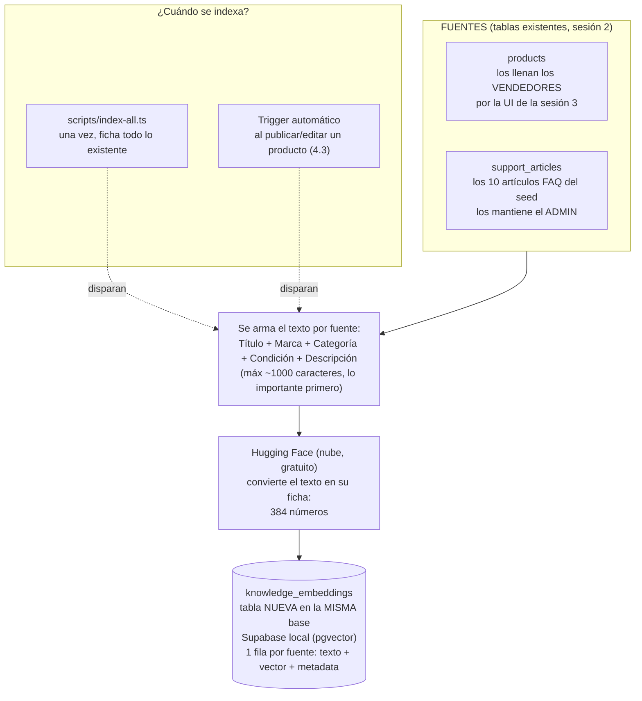
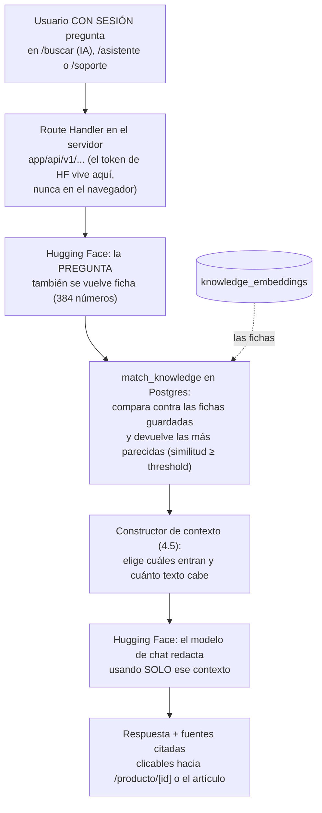

# MercadoTech — Sesión 4: Integrando IA en tu SaaS con RAG

## Este documento contiene la especificación completa de la sesión. Léelo completamente antes de generar cualquier código. No hagas suposiciones fuera de lo especificado.

**Prompts de la sesión (ejecutar en orden; versión completa y autocontenida de cada uno en `PROMPTS_sesion4.md`):**

0. "Ejecuta el Prompt 0 de `PROMPTS_sesion4.md`: verifica la sesión 3, el token de Hugging Face y provisiona las dependencias de IA."
1. "Lee `mercadotech/MercadoTech_sesion4.md` completo y confírmame que entiendes el alcance. No generes código todavía."
2. "Ejecuta la Fase 4.1: infraestructura vectorial (pgvector, tabla, índice y función de matching)."
3. "Ejecuta la Fase 4.2: capa de IA y servicio de embeddings."
4. "Ejecuta la Fase 4.3: indexación automática de productos y artículos de soporte."
5. "Ejecuta la Fase 4.4: búsqueda semántica en el catálogo."
6. "Ejecuta la Fase 4.5: constructor de contexto."
7. "Ejecuta la Fase 4.6: servicio conversacional y endpoint de chat."
8. "Ejecuta la Fase 4.7: interfaz del asistente (compras y soporte)."
9. "Ejecuta la Fase 4.8: calibración, observabilidad y casos de prueba."
10. "Ejecuta el Prompt de cierre de `PROMPTS_sesion4.md`: bitácora de la sesión en `docs/BITACORA.md` y actualización de `CLAUDE.md`."

---

## Objetivo general

Transformar MercadoTech en una plataforma con IA integrada: indexar productos y
artículos de soporte como vectores, ofrecer búsqueda semántica en el catálogo y
dos asistentes conversacionales (asesor de compras y soporte) que respondan
usando EXCLUSIVAMENTE la información de la plataforma, citando sus fuentes.

## Objetivos específicos

* Comprender el flujo completo de un sistema RAG.
* Configurar pgvector sobre Supabase.
* Generar embeddings de productos y FAQ con un proveedor gratuito.
* Implementar indexación automática al publicar/editar contenido.
* Realizar búsqueda semántica por similitud vectorial.
* Construir contexto optimizado (selección, orden, presupuesto de tokens).
* Desarrollar la interfaz conversacional con fuentes citadas y navegables.
* Dejar la base de conocimiento lista para el agente de voz (sesión 8).

---

## Qué vas a construir, en palabras simples

Hasta ahora MercadoTech busca "a lo tonto": si escribes *audífonos para el
gimnasio* y ningún título contiene la palabra "gimnasio", no encuentra nada,
aunque haya audífonos deportivos en el catálogo. En esta sesión le enseñas a la
plataforma a buscar **por significado** y a **conversar** sobre lo que sabe.

La analogía que gobierna toda la sesión es la del **bibliotecario**:

1. **Fichar los libros (indexar).** Cada producto y cada artículo de la FAQ se
   convierte en una "ficha" numérica que resume su significado (un *embedding*).
   Las fichas se guardan en un fichero especial de la base de datos (pgvector).
   Esto pasa una vez al inicio (script) y luego automáticamente cada vez que un
   vendedor publica o edita (Fases 4.1–4.3).
2. **Buscar por las fichas (recuperar).** Cuando alguien pregunta, la pregunta
   también se convierte en ficha, y la base de datos encuentra las fichas más
   *parecidas* — no las que comparten palabras, sino las que hablan de lo mismo
   (Fase 4.4).
3. **Responder solo con las fichas encontradas (generar).** Un modelo de
   lenguaje redacta la respuesta usando ÚNICAMENTE esas fichas, citándolas. Si
   ninguna ficha sirve, lo dice: "no encontré productos que coincidan" — nunca
   inventa (Fases 4.5–4.7). Eso, y no otra cosa, es RAG:
   *Retrieval-Augmented Generation* — recuperar primero, generar después.

### El flujo completo: de dónde sale la información, dónde se guarda y cómo responde

El agente RAG no tiene conocimiento propio ni sale a internet. TODO lo que
sabe viene de **dos tablas que ya existen** en la base de datos de MercadoTech
(sesión 2), y todo lo que aprende se guarda en **una tabla nueva** de la misma
base de datos. Son dos procesos independientes que comparten ese almacén:

**Pipeline 1 — Alimentación (indexar): ¿de dónde sale la info y dónde se guarda?**

**Pipeline 2 — Consulta (responder): ¿qué pasa cuando alguien pregunta?**

**Resumen de origen y almacenamiento (para no perderse):**

| Dato | ¿De dónde sale? | ¿Dónde se guarda? | ¿Quién lo mantiene al día? |
|---|---|---|---|
| Productos | Vendedores, por la UI de la sesión 3 (`products`) | Base Supabase local — ya existía | El trigger de la Fase 4.3 reficha al publicar/editar |
| Artículos FAQ | `seed.sql` de la sesión 2 (`support_articles`) | Base Supabase local — ya existía | Admin por SQL + `scripts/index-all.ts` para refichar |
| Fichas (embeddings) | Se calculan enviando el texto a Hugging Face | Tabla nueva `knowledge_embeddings`, en la MISMA base (columna `vector(384)` de pgvector) | Script inicial + trigger automático |
| La conversación del chat | El usuario la escribe | En NINGUNA parte: historial solo en memoria del navegador (persistirla no está en el alcance) | — |
| Token de Hugging Face | Cuenta personal del alumno | Solo `.env.local` (servidor) | El alumno lo rota si se filtra |

Tres consecuencias de este diseño que conviene tener presentes:

* **No hay una "base de datos de IA" aparte:** las fichas viven en la misma
  Postgres de siempre. Borrar la tabla `knowledge_embeddings` y correr
  `index-all` la reconstruye entera desde las fuentes — las fichas son
  derivadas, nunca la fuente de verdad.
* **Hugging Face no guarda nada nuestro:** se le envía texto y devuelve
  números (o una respuesta redactada). El conocimiento permanece en la base
  local; el proveedor es una calculadora externa.
* **Si mañana se agrega una fuente nueva** (ej. reseñas), el patrón es el
  mismo: otra `source_type`, otro `build...EmbeddingText`, mismo almacén,
  misma búsqueda — por eso la tabla es una sola y discriminada por tipo.

### Glosario mínimo (suficiente para toda la sesión)

| Término | En una línea |
|---|---|
| Embedding | Huella numérica del *significado* de un texto: una lista de 384 números. Textos que hablan de lo mismo tienen huellas parecidas. |
| Vector | Esa lista de números. "Base vectorial" = tabla que guarda esas listas y sabe compararlas. |
| pgvector | Extensión de Postgres que agrega el tipo `vector` y la comparación por similitud. Ya viene incluida en Supabase. |
| Similitud | Qué tan parecidas son dos huellas, de ~-1 a 1. `1` = idéntico significado. |
| Threshold (umbral) | Similitud mínima para considerar un resultado "relevante". Muy alto = no encuentra nada; muy bajo = devuelve ruido. |
| Índice HNSW | Estructura que hace rápida la búsqueda de huellas parecidas sin comparar contra todas. |
| Chunk | Trozo de un texto largo que se ficha por separado. En esta sesión cada fuente es un solo chunk (la columna queda preparada para más). |
| Token (de API) | La "llave" personal para usar la API de Hugging Face. Es secreta: vive en `.env.local`, jamás en el código ni en el chat. |
| Token (de texto) | Unidad en que los modelos miden el texto (~4 caracteres). No confundir con la llave anterior. |
| "El modelo rota" | Hugging Face quita y pone modelos de su nivel gratuito sin aviso. Por eso el modelo de chat se elige por variable de entorno, no en el código. |
| RAG | Recuperar fichas relevantes y generar la respuesta solo con ellas, citándolas. |

---

## Antes de empezar: tu cuenta de Hugging Face (tarea humana, no de Claude)

Esta es la única parte de la sesión que Claude NO puede hacer por ti. Sin esto,
nada de la sesión funciona. Hazlo una vez, toma ~5 minutos y es gratis:

1. Crea una cuenta en https://huggingface.co/join (email + contraseña; no pide tarjeta).
2. Entra a **Settings → Access Tokens → Create new token**.
3. Tipo de token: **Read** es suficiente (no necesitas Write ni Fine-grained
   para esta sesión). Ponle un nombre reconocible, ej. `mercadotech-curso`.
4. Copia el token (empieza con `hf_...`). Se muestra UNA vez; si lo pierdes,
   genera otro.
5. Pégalo en `mercadotech/.env.local` como
   `HUGGINGFACEHUB_API_TOKEN=hf_...` (el Prompt 0 deja la línea lista).

Reglas de seguridad del token:

* NUNCA lo pegues en el chat con Claude, en un commit, ni en un archivo que no
  sea `.env.local` (que ya está en `.gitignore`).
* Si sospechas que se filtró, revócalo en la misma pantalla y genera otro.

Sobre el costo: el nivel gratuito de Inference Providers incluye una cuota
mensual pequeña de creditos. Alcanza de sobra para el laboratorio (indexar ~24
fichas y conversar durante las pruebas), pero no para un sitio público con
tráfico — por eso los asistentes de esta sesión exigen sesión iniciada.

---

## Guía Hugging Face — lecciones heredadas de ReadHub (léela antes de la Fase 4.2)

ReadHub (el proyecto anterior del curso) ya integró Hugging Face y se golpeó
con todas las esquinas. Estas lecciones vienen de su código real
(`packages/ai/` de ReadHub) y esta sesión las respeta como decisiones YA
TOMADAS — no hay que re-descubrirlas ni re-decidirlas:

1. **Embeddings SOLO con el SDK oficial.** `@huggingface/inference` →
   `InferenceClient.featureExtraction(...)`. Hugging Face documenta que
   feature-extraction NO está disponible en su endpoint REST
   OpenAI-compatible; un `fetch` directo falla. Es el único lugar del proyecto
   donde se usa un SDK en vez de `fetch`, y está justificado por el proveedor.
2. **Chat SOLO con el router OpenAI-compatible.**
   `https://router.huggingface.co/v1/chat/completions` vía `fetch` (headers
   `Authorization: Bearer <token>`, body `{model, max_tokens, messages}`,
   respuesta en `choices[0].message.content`). Ahí sí NO se usa SDK.
3. **La disponibilidad de modelos gratuitos ROTA.** Cuando ReadHub probó con
   token real, `zephyr-7b-beta`, `Qwen2.5-7B-Instruct` y
   `Mistral-7B-Instruct-v0.3` ya no tenían proveedor de inferencia gratuito.
   El elegido fue `meta-llama/Llama-3.1-8B-Instruct`. Si también rota, se
   reemplaza SOLO con la variable `HUGGINGFACE_CHAT_MODEL` — cero cambios de
   código. Antes de elegir un reemplazo, probar candidatos contra la API real.
4. **MiniLM trunca en silencio.** `all-MiniLM-L6-v2` acepta máximo 256 tokens
   (~1000 caracteres); lo que sobra lo descarta sin avisar, degradando la
   búsqueda. Por eso el texto a vectorizar se arma con las señales más
   valiosas PRIMERO (título, marca, categoría) y el contenido largo AL FINAL:
   si algo se corta, se corta lo menos importante. Y por eso existe
   `MAX_EMBEDDING_INPUT_CHARS = 1000`.
5. **Validar la forma del vector.** `all-MiniLM-L6-v2` devuelve un vector
   plano de 384 números; otros modelos devuelven una matriz por token
   (`number[][]`). El código valida "array plano de números, longitud 384" y
   rechaza cualquier otra cosa — mejor un error claro que una fila corrupta.
6. **La dimensión 384 queda grabada en la columna SQL.** Cambiar a un modelo
   de embeddings con otra dimensión exige migración
   (`ALTER COLUMN ... TYPE vector(N)` + recrear índice y función), no solo
   cambiar la variable. Documentado en la propia migración.
7. **El umbral 0.3 es provisional.** Pares de texto NO relacionados ya rondan
   0.1–0.2 de similitud (comparten idioma); los relacionados suelen superar
   0.4. Se parte de 0.3 y se calibra con datos reales en la Fase 4.8.
8. **Errores distintos, mensajes distintos.** 401 = token mal configurado;
   "model not supported / no provider" = el modelo rotó (lección 3); respuesta
   vacía o sin `choices` = respuesta inválida del proveedor. La capa
   `lib/ai/` los distingue con mensajes accionables — es lo que permite que
   un alumno diagnostique sin leer código (ver tabla de síntomas al final).

## Proveedor de IA (decisión heredada — cerrada, no se re-decide)

* **Embeddings**: `sentence-transformers/all-MiniLM-L6-v2` (384 dimensiones)
  vía `@huggingface/inference` (`InferenceClient.featureExtraction`).
* **Chat**: `meta-llama/Llama-3.1-8B-Instruct` vía el router OpenAI-compatible,
  configurable por `HUGGINGFACE_CHAT_MODEL`.
* Toda la lógica que conoce la API del proveedor vive SOLO en `lib/ai/`.
  Cambiar de proveedor = tocar `lib/ai/` y `lib/constants/ai.ts`, nada más.
* Variables nuevas en `.env.example` y `.env.local`:
  `HUGGINGFACEHUB_API_TOKEN`, `HUGGINGFACE_EMBEDDING_MODEL` (opcional),
  `HUGGINGFACE_CHAT_MODEL` (opcional).

---

## Estado de partida (validar con el Prompt 0 antes de empezar)

Esta sesión construye SOBRE la sesión 3 terminada. El Prompt 0 verifica que
exista todo esto; si algo falta, se termina la sesión 3 primero:

| Debe existir | Dónde | Lo usa la fase |
|---|---|---|
| App completa de la sesión 3 (catálogo, detalle, carrito, panel vendedor) | `app/`, `components/`, `hooks/`, `services/` | 4.3, 4.4, 4.7 |
| `types/database.ts` + script `npm run db:types` | `types/`, `package.json` | 4.1 |
| Página `/buscar` con el grid reutilizable y `SearchBar` con el comentario "la búsqueda semántica llega en la sesión 4" | `app/(shop)/buscar/`, `components/layout/SearchBar.tsx` | 4.4 |
| `useProductForm` (publicar/editar del vendedor) | `hooks/useProductForm.ts` | 4.3 |
| Middleware con prefijos protegidos (`/carrito`, `/pedidos`, `/favoritos`, `/vendedor`) | `lib/supabase/middleware.ts` | 4.7 (se amplía) |
| Seed con 14 productos activos y 10 artículos de FAQ publicados | `supabase/seed.sql` | 4.3, 4.8 (24 fichas esperadas) |
| Stack Supabase local corriendo y `.env.local` con credenciales | — | todas |

Lo que NO existe y esta sesión crea: `lib/ai/`, `lib/constants/ai.ts`,
`scripts/`, `app/api/v1/*`, `app/(shop)/asistente/`, `app/(shop)/soporte/`,
`components/chat/`, la tabla `knowledge_embeddings` y sus migraciones.

### Decisiones tomadas al validar la spec contra el repo y la sesión 3

| # | Hallazgo | Resolución | Fase |
|---|---|---|---|
| 1 | La RLS de `knowledge_embeddings` (SELECT solo `authenticated`) choca con `/buscar`, que es pública: un anónimo tendría la pestaña IA muerta | La IA exige sesión: la pestaña "Resultados con IA" y los asistentes muestran "Inicia sesión para usar la búsqueda inteligente" al anónimo. También protege la cuota gratuita de Hugging Face | 4.4, 4.7 |
| 2 | Nada instala `@huggingface/inference` ni un runner TS para el script batch (`tsx` no está en `package.json`) | Prompt 0 instala ambos y hace un smoke test del token contra la API real ANTES de escribir código | 0 |
| 3 | `/asistente` y `/soporte` no existen en el mapa de rutas de la sesión 3 ni en el middleware | Se agregan aquí: ambas requieren sesión; el middleware suma los dos prefijos; `UserMenu` gana las entradas "Asistente" y "Soporte" | 4.7 |
| 4 | La migración vectorial cambia el esquema pero la spec original no regeneraba tipos | `npm run db:types` es el último paso de la Fase 4.1 | 4.1 |
| 5 | La spec original menciona "lista Mis tickets" sin nombrar servicio ni hook | `services/ticket.service.ts` (`listMine`) + `hooks/useMyTickets.ts`. Solo lectura: CREAR tickets por la UI llega con el agente (sesión 8) | 4.7 |
| 6 | Al borrar un producto queda su ficha huérfana (`source_id` sin FK dura, decisión documentada) | La hidratación de `vector-search` ya descarta huérfanos; además `deleteProduct` dispara reindex/limpieza best-effort | 4.3, 4.4 |
| 7 | La sesión 1 no se ejecutó: no hay `docs/COSTOS.md` con la tabla tarea → modelo | La columna "Modelo sugerido" vive en `PROMPTS_sesion4.md` | — |
| 8 | El token de Hugging Face no puede generarlo Claude | Sección "Antes de empezar" (tarea humana) + verificación en el Prompt 0 | 0 |

---

## Mapa de fases y dependencias

| Fase | Qué entrega (en una línea) | Depende de | Se verifica con |
|---|---|---|---|
| 4.1 | Migraciones: pgvector, tabla `knowledge_embeddings`, índice HNSW, RPC `match_knowledge`, RLS; tipos regenerados | sesión 3 + Prompt 0 | `db reset` limpio; el RPC responde con un vector de prueba |
| 4.2 | `lib/constants/ai.ts` + `lib/ai/` (embeddings, completion, prompts) + `embedding.service` | 4.1 | script de humo genera una ficha real de 384 números |
| 4.3 | Endpoint `/api/v1/reindex`, trigger en publicar/editar, script `index-all` | 4.2 | tras `index-all`: 24 filas; publicar un producto crea la 25 |
| 4.4 | `vector-search.service`, endpoint `/api/v1/search/semantic`, pestaña IA en `/buscar` | 4.3 | "audífonos para el gimnasio" trae audio deportivo primero |
| 4.5 | Constructor de contexto puro (selección + presupuesto) | 4.4 | funciones puras demostradas con datos de ejemplo (sin red) |
| 4.6 | `chat.service` + endpoint `/api/v1/chat` + `types/chat.ts` | 4.5 | `curl` al endpoint devuelve respuesta con fuentes |
| 4.7 | `useChat`, `components/chat/`, páginas `/asistente` y `/soporte` (+ Mis tickets), navbar y middleware | 4.6 | conversación completa en el navegador con fuentes clicables |
| 4.8 | Calibración de thresholds + `docs/RAG.md` con los 6 casos ejecutados | 4.7 | los 6 casos pasan y quedan documentados |

## Convenciones transversales (además de las de la sesión 3, que siguen vigentes)

* **La UI jamás importa `lib/ai/`.** El navegador llega a la IA solo por esta
  cadena: hook → `fetch` a `app/api/v1/*` → service → `lib/ai/`. Los Route
  Handlers existen porque el token de Hugging Face y el cliente admin no
  pueden viajar al navegador — es exactamente el caso "server-only" para el
  que la sesión 2 reservó `app/api/v1/`.
* **Errores accionables.** `lib/api-response.ts` (`apiError(status, code,
  message)`) para respuestas de error consistentes en los 3 endpoints; los
  mensajes distinguen token inválido / modelo no disponible / cuota excedida
  (ver Guía Hugging Face, lección 8).
* **Sin token configurado, la app no se rompe:** el resto de MercadoTech
  funciona normal y el chat/búsqueda IA devuelven un error controlado inline.
* **Tunables SOLO en `lib/constants/ai.ts`**, cada uno con el comentario que
  justifica su valor (los valores y sus porqués vienen calibrados de ReadHub).
* `numeric` sigue llegando como `string`: los precios que entren a `metadata`
  de las fichas o a las cards de fuentes se convierten en el service.

---

# FASES

## Fase 4.1 — Infraestructura vectorial

**Prompt sugerido:** "Ejecuta la Fase 4.1 de `MercadoTech_sesion4.md`."

### Qué se construye

El "fichero" del bibliotecario: la tabla donde vivirán las fichas (embeddings)
de productos y artículos, el índice que hace rápida la búsqueda por parecido,
y la función SQL que, dado el embedding de una pregunta, devuelve las fichas
más similares. Todo por migraciones NUEVAS. Sin IA todavía: en esta fase no se
llama a Hugging Face.

### Depende de

Sesión 3 completa + Prompt 0 (stack local corriendo).

### Archivos

| Archivo | Responsabilidad |
|---|---|
| `supabase/migrations/<ts>_enable_pgvector.sql` | `create extension vector with schema extensions` (no en `public`). |
| `supabase/migrations/<ts>_create_knowledge_embeddings.sql` | La tabla (abajo), su `unique`, RLS habilitado y el índice HNSW (`vector_cosine_ops`). Comentario obligatorio: cambiar de modelo/dimensión exige `ALTER COLUMN ... TYPE vector(N)` + recrear índice y función. |
| `supabase/migrations/<ts>_create_match_knowledge.sql` | RPC `match_knowledge` (abajo). |
| `supabase/migrations/<ts>_knowledge_embeddings_rls.sql` | Políticas + GRANTs (abajo). |
| `supabase/schema.sql`, `supabase/policies.sql` | Copias de referencia actualizadas. |
| `types/database.ts` | Regenerado con `npm run db:types` al final (decisión 4). |

**Tabla `knowledge_embeddings`** — UNA tabla para las dos fuentes, discriminada
por tipo (más simple que dos tablas gemelas y permite búsquedas conjuntas):

| Campo | Tipo | Notas |
|---|---|---|
| id | uuid PK | |
| source_type | text | check: `'producto'` / `'articulo_soporte'` |
| source_id | uuid | id del producto o del artículo. SIN FK dura: apunta a dos tablas origen distintas; se valida en el service (documentar el porqué en la migración) |
| chunk_index | integer | default 0 (preparado para chunking futuro) |
| content | text | el texto que se vectorizó |
| embedding | vector(384) | not null |
| metadata | jsonb | default `'{}'` (título, categoría, precio…) |
| created_at | timestamptz | |

`unique(source_type, source_id, chunk_index)`.

**RPC `match_knowledge(query_embedding vector(384), p_source_type text,
match_count int, similarity_threshold float)`** — SECURITY INVOKER (respeta la
visibilidad del caller), `set search_path` fijado; devuelve `source_type,
source_id, content, metadata, similarity`, ordenado por similitud descendente.
Si `p_source_type` es null, busca en ambas fuentes.

### Reglas

* RLS: SELECT para `authenticated` (decisión 1: la IA exige sesión; los
  productos inactivos se filtran en el service cruzando con `products`);
  INSERT/UPDATE/DELETE sin política ni GRANT — solo el service role escribe.
  GRANTs explícitos, patrón de la sesión 2 (RLS sin GRANT = error opaco).
* NO tocar migraciones existentes. `supabase db reset` debe reconstruir todo.

### Cómo verificar al terminar (sin saber programar)

* `supabase db reset` termina sin errores y la tabla aparece en Studio
  (http://127.0.0.1:54323 → Table Editor → `knowledge_embeddings`, vacía).
* En Studio → SQL Editor, `select public.match_knowledge(array_fill(0.1, array[384])::vector, null, 5, 0.0);`
  devuelve 0 filas SIN error (la función existe y acepta un vector de prueba).
* `types/database.ts` menciona `knowledge_embeddings` y `match_knowledge`.
* `npm run lint` y `npm run type-check` pasan.

## Fase 4.2 — Capa de IA y servicio de embeddings

**Prompt sugerido:** "Ejecuta la Fase 4.2 de `MercadoTech_sesion4.md`."

### Qué se construye

El único rincón del proyecto que habla con Hugging Face (`lib/ai/`), sus
tunables documentados, y el servicio que orquesta "cargar la fuente → armar el
texto → generar la ficha → guardarla". Primera fase que usa el token real.

### Depende de

4.1 (tabla y tipos) + token verificado en el Prompt 0.

### Archivos

| Archivo | Responsabilidad |
|---|---|
| `lib/constants/ai.ts` | TODOS los tunables, cada uno con el comentario que justifica su valor (los porqués vienen de ReadHub): `EMBEDDING_DIMENSIONS = 384`, `EMBEDDING_MODEL_DEFAULT = "sentence-transformers/all-MiniLM-L6-v2"`, `MAX_EMBEDDING_INPUT_CHARS = 1000` (MiniLM trunca a 256 tokens en silencio), `VECTOR_SEARCH_DEFAULT_TOP_K = 5`, `VECTOR_SEARCH_MAX_TOP_K = 20`, `VECTOR_SEARCH_DEFAULT_SIMILARITY_THRESHOLD = 0.3` (provisional, se calibra en 4.8), `CONTEXT_BUILDER_DEFAULT_MAX_SOURCES = 5`, `CONTEXT_BUILDER_DEFAULT_MIN_SIMILARITY = 0.3`, `CONTEXT_BUILDER_MIN_CONTENT_LENGTH = 20`, `CONTEXT_BUILDER_DEFAULT_MAX_CONTEXT_CHARS = 8000`, `CONTEXT_BUILDER_MIN_TRUNCATED_SOURCE_CHARS = 200`, `HUGGINGFACE_CHAT_MODEL_DEFAULT = "meta-llama/Llama-3.1-8B-Instruct"`, `HUGGINGFACE_CHAT_MAX_TOKENS = 1024`, `CHAT_QUERY_MAX_CHARS = 4000`. |
| `lib/ai/embeddings.ts` | `generateEmbedding(text)` con `InferenceClient.featureExtraction` (Guía HF, lección 1); valida vector plano de exactamente 384 números (lección 5). `buildProductEmbeddingText(product, category)` y `buildSupportArticleEmbeddingText(article)`: secciones etiquetadas (`Título:`, `Marca:`, …) en orden de mayor a menor densidad semántica, contenido largo al final, truncado a `MAX_EMBEDDING_INPUT_CHARS` (lección 4). |
| `lib/ai/completion.ts` | `generateCompletion(system, user)` con `fetch` al router OpenAI-compatible (lección 2); devuelve `{text, model, stopReason}`; errores accionables que distinguen 401 / modelo no disponible / respuesta inválida (lección 8). |
| `lib/ai/prompts.ts` | `SHOPPING_SYSTEM_INSTRUCTIONS` (asesor de compras: SOLO productos del contexto, cita fuentes numeradas, nunca inventa precios/stock, admite cuando no hay coincidencias); `SUPPORT_SYSTEM_INSTRUCTIONS` (soporte: SOLO la FAQ del contexto, sugiere crear ticket si no hay respuesta, tono cordial, respuestas CORTAS — en la sesión 8 se leerán en voz alta, dejar este comentario en el código); `buildRagUserMessage(query, sources)`. |
| `services/embedding.service.ts` | Orquesta: carga la fuente (producto+categoría o artículo), arma el texto, genera el embedding, upsert en `knowledge_embeddings`. El cliente ADMIN se lo INYECTA el caller (Route Handler / script); este service no lo importa. |

### Reglas

* Ningún archivo fuera de `lib/ai/` importa `@huggingface/*` (criterio de
  aceptación con grep).
* `lib/ai/` no importa React ni Supabase; `embedding.service.ts` no importa
  `lib/supabase/admin.ts` (se lo inyectan).
* Los textos de `prompts.ts` van en español, como todo lo visible.

### Cómo verificar al terminar

* Script temporal de humo (en el scratchpad, no en el repo): genera el
  embedding de `"laptop liviana para estudiar"` → imprime `length: 384` y los
  5 primeros números; y una completion de prueba → imprime texto y modelo.
* Quitar temporalmente el token de `.env.local` y repetir → mensaje claro
  "HUGGINGFACEHUB_API_TOKEN no está configurada" (y se restaura el token).
* `grep -rln "@huggingface" --include="*.ts" . | grep -v node_modules | grep -v lib/ai` → vacío.
* Lint y type-check pasan.

## Fase 4.3 — Indexación automática

**Prompt sugerido:** "Ejecuta la Fase 4.3 de `MercadoTech_sesion4.md`."

### Qué se construye

Que las fichas se mantengan solas: un endpoint server-only que reindexa una
fuente, el disparador silencioso desde publicar/editar producto, y el script
que ficha todo el seed de una vez.

### Depende de

4.2 (`embedding.service`), sesión 3 (`useProductForm`).

### Archivos

| Archivo | Responsabilidad |
|---|---|
| `lib/api-response.ts` | Helper `apiError(status, code, message)` para respuestas de error consistentes (lo usan los 3 endpoints de la sesión). |
| `app/api/v1/reindex/route.ts` | `POST {sourceType, sourceId}`: valida sesión (401 si no hay), valida body (400), usa el cliente admin + `embedding.service`. Si la fuente ya no existe (producto borrado), elimina sus fichas (decisión 6). |
| `services/indexing-trigger.service.ts` | `triggerReindex(sourceType, sourceId)`: `fetch` fire-and-forget al endpoint. NUNCA bloquea ni rompe el flujo de publicación (best-effort + `console.warn` si falla). |
| `hooks/useProductForm.ts` | AMPLIAR: tras crear/editar con éxito, llama a `triggerReindex('producto', id)`. |
| `hooks/useSellerProducts.ts` | AMPLIAR: tras `toggleActive` o `deleteProduct`, dispara el trigger (reindexa o limpia la ficha). |
| `scripts/index-all.ts` | One-shot con el cliente admin (corre con `npx tsx`, fuera del navegador): indexa TODOS los productos activos y artículos publicados; imprime el conteo por tipo. Si el admin edita artículos por SQL, este script es la vía de reindexación (documentarlo en su cabecera). |

### Reglas

* El navegador jamás toca el cliente admin: solo el Route Handler y el script.
* El trigger es invisible para el vendedor: publicar no se vuelve más lento ni
  falla si Hugging Face está caído.

### Cómo verificar al terminar

* `npx tsx scripts/index-all.ts` → reporta 14 productos + 10 artículos = 24
  fichas; en Studio, `knowledge_embeddings` tiene 24 filas.
* Como `seller1`, publicar un producto nuevo por la UI → en unos segundos hay
  25 filas (caso de prueba 1 de la Fase 4.8). Editar su título → sigue habiendo
  25 (upsert, no duplicado) y `content` refleja el título nuevo.
* Apagar el "wifi" del token (renombrarlo en `.env.local`) y publicar otro
  producto → la publicación FUNCIONA igual; la consola del server muestra el
  warn. Restaurar el token.

## Fase 4.4 — Búsqueda semántica en el catálogo

**Prompt sugerido:** "Ejecuta la Fase 4.4 de `MercadoTech_sesion4.md`."

### Qué se construye

La primera cara visible de la sesión: en `/buscar`, junto a la búsqueda por
texto de la sesión 3, aparece la pestaña "Resultados con IA" que encuentra
productos por significado. Reutiliza el MISMO grid — cero duplicación.

### Depende de

4.3 (fichas pobladas), sesión 3 (`/buscar`, grid, `SearchBar`).

### Archivos

| Archivo | Responsabilidad |
|---|---|
| `services/vector-search.service.ts` | `searchByEmbedding(embedding, opts)` (llama al RPC `match_knowledge`) y `searchProducts(query, opts)`: embedding de la consulta + matching (`source_type='producto'`) + hidratación (join con `products` activos para precio/imagen ACTUALES, descartando huérfanos y con `image_url` resuelta — mismas convenciones que `product.service`). |
| `app/api/v1/search/semantic/route.ts` | `POST {query}`: requiere sesión (401); valida query no vacía y `<= CHAT_QUERY_MAX_CHARS`; el embedding de la consulta se genera server-side (el token no viaja al navegador); usa el cliente de SESIÓN para el RPC (la RLS aplica). |
| `hooks/useSemanticSearch.ts` | Estado de búsqueda, llama al endpoint, expone `{results, loading, error}`. |
| `app/(shop)/buscar/page.tsx` | AMPLIAR: `tabs` "Coincidencia exacta" (la de la sesión 3, intacta) / "Resultados con IA". La pestaña IA: mismo `ProductGrid`, badge de similitud opcional en cada card, y si no hay sesión muestra `EmptyState` "Inicia sesión para usar la búsqueda inteligente" con botón a `/login?redirectTo=` (decisión 1). |
| `components/layout/SearchBar.tsx` | Sin cambios de comportamiento: sigue navegando a `/buscar?q=`; se retira el comentario "llega en la sesión 4". |

### Reglas

* Sin resultados relevantes (todo bajo el threshold): `EmptyState` con
  sugerencia de reformular — no una lista vacía muda.
* La pestaña exacta sigue funcionando para anónimos exactamente igual que en
  la sesión 3.

### Cómo verificar al terminar

* Con sesión, buscar **"audífonos para el gimnasio"** → la pestaña IA muestra
  los audífonos deportivos primero, aunque ningún título diga "gimnasio"; la
  pestaña exacta (ilike) no los encuentra. Esa diferencia ES la sesión.
* Buscar "algo para conectar mi casa a internet" → aparece el router del seed.
* Sin sesión, la pestaña IA muestra el aviso de login; la exacta funciona.
* Buscar "autos usados" → EmptyState con sugerencia (no resultados forzados).

## Fase 4.5 — Constructor de contexto

**Prompt sugerido:** "Ejecuta la Fase 4.5 de `MercadoTech_sesion4.md`."

### Qué se construye

El "criterio del bibliotecario": de todas las fichas recuperadas, cuáles
entran de verdad en el escritorio del redactor y en qué orden, sin pasarse del
espacio disponible. Es una función PURA: cero red, cero Supabase, cero React —
por eso es 100 % testeable en aislamiento (se testea en la sesión 6).

### Depende de

4.4 (forma de los resultados de búsqueda). No usa el token.

### Archivos

| Archivo | Responsabilidad |
|---|---|
| `lib/ai/context-builder.ts` | Entrada: query + resultados + opciones. (1) Selección: filtra por `minSimilarity` y `MIN_CONTENT_LENGTH`, ordena por similitud, corta a `maxSources`. (2) Presupuesto: acumula contenido hasta `maxContextChars`; si a la última fuente le quedan menos de `MIN_TRUNCATED_SOURCE_CHARS`, se descarta entera (media frase confunde más de lo que aporta). (3) Salida: `{userMessage, sources[], stats: {contextTruncated, totalChars}}`, donde `sources` conserva `source_type`, `source_id`, título y similitud — la UI los convertirá en enlaces. |

### Reglas

* Todos los umbrales salen de `lib/constants/ai.ts`; nada hardcodeado.
* Sin I/O: si el archivo importa `fetch`, Supabase o React, está mal.

### Cómo verificar al terminar

* Demostración en frío (sin red), pegada en la salida del prompt: con 8
  resultados de ejemplo (2 bajo el threshold, 1 con contenido de 5 caracteres,
  1 que excede el presupuesto), la función devuelve exactamente los esperados,
  en orden, con `contextTruncated` correcto.
* Lint y type-check pasan.

## Fase 4.6 — Servicio conversacional y endpoint

**Prompt sugerido:** "Ejecuta la Fase 4.6 de `MercadoTech_sesion4.md`."

### Qué se construye

La tubería completa de conversación, todavía sin interfaz: un servicio que
encadena búsqueda → contexto → redacción, y el endpoint que la expone. Al
terminar se puede conversar con MercadoTech desde `curl`, antes de que exista
la pantalla.

### Depende de

4.5 (constructor), 4.4 (búsqueda), 4.2 (completion, prompts).

### Archivos

| Archivo | Responsabilidad |
|---|---|
| `types/chat.ts` | `ChatMessage`, `ChatResult`, `ChatSource`. |
| `services/chat.service.ts` | `ask(query, mode: 'compras' \| 'soporte', opts, supabase)` — orquesta SIN reimplementar nada: `vector-search` (filtrando `source_type` según modo: compras → productos, soporte → artículos) → `context-builder` → `generateCompletion` con las instrucciones del modo → `ChatResult`: `{query, answer, hasRelevantContext, sources, metadata: {model, retrievedCount, usedSourceCount, contextTruncated}}`. |
| `app/api/v1/chat/route.ts` | `POST {query, mode}`: requiere sesión (401); valida body JSON, query no vacía y `<= CHAT_QUERY_MAX_CHARS`, `mode` válido (400/422); usa el cliente de SESIÓN (no admin) para que la búsqueda respete RLS; log estructurado de `retrievedCount/usedSourceCount/hasRelevantContext` (insumo de la 4.8); errores con `apiError`. |

### Reglas

* `chat.service` no conoce Hugging Face (llama a `lib/ai/completion`) ni la
  forma de la tabla (llama a `vector-search`). Si necesita algo nuevo, se
  agrega en la capa dueña, no aquí.

### Cómo verificar al terminar

* Con una cookie de sesión válida (el prompt indica cómo obtenerla del
  navegador), `curl -X POST /api/v1/chat` con
  `{"query":"¿qué laptop me recomiendas para diseño?","mode":"compras"}` →
  JSON con `answer` citando productos reales y `sources` con sus ids.
* Mismo `curl` sin cookie → 401 con mensaje del helper; body inválido → 400;
  `mode` desconocido → 422.
* La terminal del server muestra el log estructurado de cada consulta.

## Fase 4.7 — Interfaz del asistente

**Prompt sugerido:** "Ejecuta la Fase 4.7 de `MercadoTech_sesion4.md`."

### Qué se construye

Las dos caras conversacionales: `/asistente` (asesor de compras) y `/soporte`
(agente de FAQ + lista "Mis tickets"), con el chat como componentes puros y
las fuentes citadas convertidas en enlaces navegables.

### Depende de

4.6 (endpoint), sesión 3 (`UserMenu`, middleware, `ProductCard`).

### Archivos

| Archivo | Responsabilidad |
|---|---|
| `hooks/useChat.ts` | Parametrizado por modo. Historial de mensajes en memoria, `sendMessage`, `loading`; los errores del servidor se convierten en un mensaje inline del asistente ("No pude procesar tu consulta…") — la conversación NUNCA se rompe. |
| `services/ticket.service.ts` | `listMine(userId)` (decisión 5). Solo lectura: crear tickets por la UI llega con el agente de la sesión 8. |
| `hooks/useMyTickets.ts` | Lista de tickets del usuario con su estado. |
| `components/chat/ChatWindow.tsx` | Compone la conversación; auto-scroll al último mensaje. |
| `components/chat/ChatMessage.tsx` | Burbujas usuario vs asistente. |
| `components/chat/LoadingMessage.tsx` | Indicador de "escribiendo…". |
| `components/chat/ChatInput.tsx` | Textarea con submit por Enter, deshabilitado durante la carga. |
| `components/chat/SourcesList.tsx` | Fuentes citadas: producto → mini-card con imagen/`Price` y link a `/producto/[id]`; artículo → título y categoría con link (la página del artículo llega después; por ahora ancla al propio `/soporte`). |
| `app/(shop)/asistente/page.tsx` | Modo 'compras'. Sugerencias de arranque clicables (ej. "¿qué laptop me recomiendas para diseño por menos de S/ 3,500?"). |
| `app/(shop)/soporte/page.tsx` | Modo 'soporte' + sección "Mis tickets" debajo (`OrderStatusBadge`-style para el estado). Esta página se AMPLÍA con voz en la sesión 8: el layout deja espacio para el botón de micrófono (comentario en el código). |
| `components/layout/UserMenu.tsx` + `MobileNav.tsx` | AMPLIAR: entradas "Asistente" y "Soporte" (decisión 3 — en la sesión 3 se omitieron a propósito). |
| `lib/supabase/middleware.ts` | AMPLIAR: `/asistente` y `/soporte` se suman a los prefijos que exigen sesión. |

### Reglas

* Los componentes de `components/chat/` son puros: reciben mensajes y
  callbacks; no conocen el endpoint ni `lib/ai/`.
* Textos en español, cortos; los del modo soporte aún más (se leerán en voz
  alta en la sesión 8).

### Cómo verificar al terminar

* Flujo completo en el navegador: preguntar "laptop liviana para la
  universidad" en `/asistente` → respuesta citando 2+ productos reales; clic
  en una fuente → abre el producto correcto.
* En `/soporte`: "¿cómo devuelvo un producto?" → respuesta basada en el
  artículo de devoluciones, citado; "¿venden autos usados?" → admite que no
  tiene esa información y sugiere crear un ticket.
* `buyer1` ve sus tickets del seed en "Mis tickets"; `buyer3` ve los suyos.
* Anónimo entrando a `/asistente` → `/login?redirectTo=/asistente`.
* Si el server se levanta SIN token, el chat responde con el mensaje de error
  inline y el resto de la app funciona normal.

## Fase 4.8 — Calibración, observabilidad y casos de prueba

**Prompt sugerido:** "Ejecuta la Fase 4.8 de `MercadoTech_sesion4.md`."

### Qué se construye

Nada nuevo: se comprueba que el bibliotecario ficha, encuentra y responde bien,
se ajustan los umbrales con datos reales y todo queda documentado en
`docs/RAG.md` para que cualquiera lo repita.

### Depende de

4.1–4.7 completas.

### Pasos

1. `npx tsx scripts/index-all.ts` y verificar: conteo de fichas == productos
   activos + artículos publicados (24 con el seed intacto; más los creados en
   las pruebas).
2. Ejecutar y documentar en `docs/RAG.md` los 6 casos:

| Caso | Entrada | Resultado esperado |
|---|---|---|
| 1. Indexación automática | publicar producto nuevo por la UI | fila nueva en `knowledge_embeddings` |
| 2. Recuperación semántica | "audífonos para gimnasio" | productos de audio deportivo primero |
| 3. Respuesta contextual (compras) | "laptop liviana para la universidad" | respuesta cita 2+ productos reales con links |
| 4. Respuesta contextual (soporte) | "¿cómo devuelvo un producto?" | respuesta basada en el artículo de devoluciones, citado |
| 5. Sin información | "¿venden autos usados?" | admite que no hay resultados; soporte sugiere ticket |
| 6. Navegación desde fuentes | clic en fuente | abre el producto/artículo correcto |

3. Con los logs del endpoint (`retrievedCount/usedSourceCount/
   hasRelevantContext` por consulta), decidir si el threshold 0.3 se queda o
   se mueve: si consultas legítimas devuelven 0 fuentes → bajar; si entra
   ruido irrelevante al contexto → subir. Documentar el antes/después en
   `docs/RAG.md` (aunque la decisión sea "se queda en 0.3, porque…").

### Cómo verificar al terminar

* `docs/RAG.md` contiene los 6 casos con su evidencia (qué se escribió, qué
  respondió, captura o transcripción) y la sección de calibración con datos.
* Lint, type-check y build pasan.

---

## Si algo falla: síntomas y diagnóstico (pegar en `docs/RAG.md`)

| Síntoma | Causa más probable | Qué hacer |
|---|---|---|
| Error 401 de Hugging Face | Token ausente, mal copiado o revocado | Revisar `HUGGINGFACEHUB_API_TOKEN` en `.env.local` (empieza con `hf_`); reiniciar `npm run dev` tras cambiarlo |
| "model not supported" / "no provider available" en el chat | El modelo gratuito rotó (Guía HF, lección 3) | Cambiar `HUGGINGFACE_CHAT_MODEL` en `.env.local` por un candidato probado contra la API real; NO tocar código |
| Error 429 / "rate limit" | Cuota gratuita del mes agotada o ráfaga de llamadas | Esperar, o revisar en huggingface.co → Settings → Billing cuánta cuota queda |
| La pestaña IA nunca trae resultados | No se corrió `index-all` (tabla vacía) o threshold muy alto | Contar filas de `knowledge_embeddings` en Studio; si hay 0 → correr el script; si hay 24 → bajar el threshold y recargar |
| La búsqueda IA trae cosas sin relación | Threshold muy bajo | Subirlo en `lib/constants/ai.ts` y documentar en `docs/RAG.md` |
| El chat responde pero sin fuentes | El contexto llegó vacío (`hasRelevantContext: false`) | Es el comportamiento correcto para preguntas fuera del catálogo/FAQ; si pasa con preguntas legítimas → calibración (4.8) |
| Embeddings fallan pero el chat funciona (o viceversa) | Son dos vías distintas (SDK vs router) | Revisar el mensaje: `lib/ai/` distingue cuál de las dos falló |
| Publicar un producto no crea su ficha | El trigger es best-effort y el server no ve el token | Buscar el `console.warn` en la terminal del server; correr `index-all` como plan B |

---

## Restricciones de la sesión

* NO implementar voz (sesión 8). NO implementar herramientas/acciones del
  agente (consultar estado de pedido, CREAR tickets desde el chat) — en esta
  sesión el chat SOLO responde con conocimiento indexado; los tickets solo se
  listan.
* NO usar el cliente admin fuera de Route Handlers y `scripts/`.
* NO hardcodear tunables fuera de `lib/constants/ai.ts`.
* NO modificar migraciones existentes, `seed.sql` ni políticas RLS previas
  (solo las migraciones NUEVAS de la Fase 4.1).
* La UI no importa `lib/ai/` — siempre hooks → endpoint → service.
* NO re-decidir proveedor, modelos ni dimensiones: están cerrados (Guía HF).
* NO exponer la IA a usuarios anónimos (decisión 1).

## Entregables

1. Migraciones vectoriales + `match_knowledge` + RLS/GRANTs + tipos regenerados.
2. `lib/ai/` completo (embeddings, completion, prompts, context-builder) +
   `lib/constants/ai.ts` documentado.
3. Servicios: embedding, vector-search, chat, indexing-trigger, ticket (listMine) + script `index-all`.
4. Endpoints: `/api/v1/reindex`, `/api/v1/search/semantic`, `/api/v1/chat` + `lib/api-response.ts`.
5. Pestaña "Resultados con IA" en `/buscar` + páginas `/asistente` y `/soporte`
   (con "Mis tickets"), navbar y middleware ampliados.
6. `docs/RAG.md` con los 6 casos ejecutados, la calibración y la tabla de síntomas.
7. Bitácora y `CLAUDE.md` actualizados (Prompt de cierre).

## Criterios de aceptación de la sesión

* Los 6 casos de prueba pasan y quedan documentados en `docs/RAG.md`.
* Sin `HUGGINGFACEHUB_API_TOKEN`, el resto de la app funciona normal y el
  chat/búsqueda IA devuelven un error controlado inline (nunca una pantalla rota).
* Anónimo: catálogo y búsqueda exacta intactos; pestaña IA, `/asistente` y
  `/soporte` piden sesión.
* `grep -rln "@huggingface" --include="*.ts" . | grep -v node_modules | grep -v lib/ai` → vacío.
* `grep -rl "lib/supabase/admin" app components hooks services | grep -v api/v1` → vacío (admin solo en Route Handlers; `scripts/` está fuera de esas carpetas).
* `npm run lint`, `npm run type-check` y `npm run build` pasan.

---

## Registro de cambios de esta versión de la spec (2026-08-24)

Validación contra el repositorio, la spec de la sesión 3 (versión validada) y
el código real de ReadHub (`packages/ai/`). Cambios respecto a la versión
anterior:

* **Estructura:** mismo patrón que la sesión 3 (Estado de partida, decisiones
  de validación, mapa de fases, por fase: Qué/Depende/Archivos/Reglas/Cómo
  verificar, registro de cambios) + Prompt 0 y Prompt de cierre.
* **Capa didáctica nueva** (el contenido técnico era claro para quien programó
  ReadHub, no para un alumno): "Qué vas a construir en palabras simples" con
  la analogía del bibliotecario, glosario, el esquema completo del flujo RAG
  (pipelines de alimentación y consulta + tabla de origen/almacenamiento de
  cada dato), la tarea humana
  del token paso a paso, la Guía Hugging Face con las 8 lecciones de ReadHub
  citando su código real, verificaciones por fase en lenguaje de acciones y la
  tabla de síntomas y diagnóstico.
* **Corrección obligatoria:** el acceso anónimo a la búsqueda IA contradecía
  la RLS definida por la propia spec → toda la IA exige sesión (decisión 1).
* **Archivos que faltaban:** `ticket.service.ts`/`useMyTickets` para "Mis
  tickets"; regeneración de `types/database.ts`; ampliación de middleware,
  `UserMenu` y `useSellerProducts`; manejo de fichas huérfanas al borrar.
* **Sin cambios de alcance funcional** salvo la restricción de sesión para la
  IA: mismas 8 fases, mismos tunables, mismos 6 casos de prueba.
