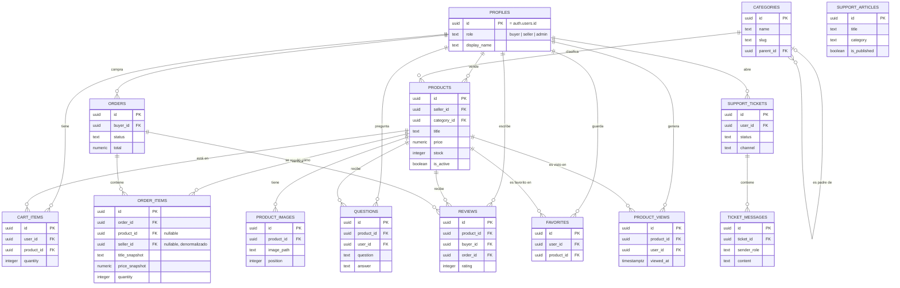

# Arquitectura de MercadoTech

Este documento describe la infraestructura construida hasta el cierre de la
sesión 2: proyecto Next.js, base de datos, seguridad a nivel de fila (RLS),
Storage y datos de prueba. Está escrito para alguien que se une al proyecto
sin haber estado en las sesiones anteriores.

No hay todavía pantallas, hooks, services de negocio ni endpoints — eso es
la sesión 3. Lo que existe hoy es la infraestructura sobre la que se va a
construir.

## Tabla de contenidos

1. [Arquitectura general y capas](#1-arquitectura-general-y-capas)
2. [Organización de carpetas](#2-organización-de-carpetas)
3. [Modelo relacional](#3-modelo-relacional)
4. [Decisiones de diseño](#4-decisiones-de-diseño)
5. [Integración Next.js ↔ Supabase](#5-integración-nextjs--supabase)
6. [Flujo de autenticación](#6-flujo-de-autenticación)
7. [Estrategia de escalabilidad](#7-estrategia-de-escalabilidad)
8. [Políticas RLS](#8-políticas-rls)
9. [Qué sigue](#9-qué-sigue)

---

## 1. Arquitectura general y capas

MercadoTech es una app Next.js 15 (App Router) sobre Supabase (Postgres +
Auth + Storage). La regla de diseño que gobierna todo el código de la app es
la separación estricta por capas, con un solo sentido de dependencia:

```
components/   →  presentación pura. Reciben props, no hacen fetching, no conocen Supabase.
hooks/        →  estado de cliente. Llaman a services. Sin lógica de negocio propia.
services/     →  lógica de negocio. Cada función recibe un SupabaseClient inyectable
                  (default: cliente de navegador) — así hooks y Route Handlers
                  comparten la misma lógica, y los tests la mockean sin red.
lib/supabase/ →  los 4 clientes de Supabase (sección 5).
lib/ai/       →  únicos archivos que van a conocer la API del proveedor de IA (sesión 4).
lib/voice/    →  únicos archivos que van a conocer la API de voz (sesión 8).
lib/validators/ → validación framework-agnóstica, compartida entre UI y servidor.
lib/constants/  → tunables centralizados (roles, estados, límites).
types/          → tipos de dominio + database.ts generado por Supabase.
app/api/v1/     → Route Handlers delgados, solo para lo que no puede correr
                    en el navegador (secretos de IA, service role, cookies de sesión).
```

Reglas derivadas:

- **Un archivo, una responsabilidad.** `product.service.ts` no va a saber de
  pedidos; `order.service.ts` no va a saber de embeddings.
- **Sin barrels.** Se importa el archivo específico, nunca "todo el módulo".
- **La UI nunca importa `lib/ai/`, `lib/voice/` ni `lib/supabase/admin.ts`.**
- **Un solo camino de datos:** hooks → services → Supabase (RLS). No se
  construye una API REST paralela "por si acaso".
- **Todo tunable vive en `lib/constants/`**, con un comentario que justifica
  su valor.

Hoy `components/`, `hooks/`, `services/`, `lib/validators/`, `lib/ai/` y
`lib/voice/` están vacíos (con `.gitkeep`) — son la estructura donde va a
vivir el código de la sesión 3 en adelante. Lo que sí existe y funciona
completo es todo lo de `lib/supabase/`, `lib/constants/roles.ts` y la base de
datos completa en `supabase/`.

La autorización real vive en la base de datos (RLS), no en el código de la
app: cualquier capa que llegue a existir en `services/` va a heredar el
control de acceso automáticamente por usar el cliente de Supabase correcto,
sin tener que reimplementar reglas de permisos en TypeScript.

## 2. Organización de carpetas

```
mercadotech/
├── app/
│   ├── (auth)/          # login, register — vacío, sesión 3
│   ├── (shop)/          # catálogo, producto, carrito, pedidos — vacío, sesión 3
│   ├── (seller)/        # panel del vendedor — vacío, sesión 3
│   └── api/v1/          # Route Handlers server-only — vacío, sesiones 3-4
├── components/          # vacío, sesión 3
├── hooks/               # vacío, sesión 3
├── services/            # vacío, sesión 3
├── lib/
│   ├── supabase/        # client.ts · server.ts · middleware.ts · admin.ts (completo)
│   ├── validators/      # vacío
│   ├── constants/        # roles.ts (completo)
│   ├── ai/                # vacío, sesión 4
│   ├── voice/             # vacío, sesión 8
│   └── utils.ts           # cn() de shadcn/ui
├── types/
│   └── database.ts        # placeholder — ver nota abajo
├── supabase/
│   ├── migrations/         # 19 migraciones, fuente de verdad del esquema
│   ├── schema.sql            # copia de referencia (NO fuente de verdad)
│   ├── policies.sql          # copia de referencia (NO fuente de verdad)
│   ├── seed.sql               # datos de prueba
│   └── tests/                  # vacío — validación RLS, sesión 2.6
└── docs/
    └── ARQUITECTURA.md          # este archivo
```

> **Nota — divergencia con la spec:** el árbol original de la Fase 2.1
> contemplaba `types/product.ts`, `types/order.ts`, `types/user.ts`, etc. Hoy
> solo existe `types/database.ts`, y es un **placeholder manual**:
>
> ```ts
> export type Database = {
>   public: { Tables: Record<string, never>; Views: Record<string, never>; /* ... */ };
> };
> ```
>
> Con el esquema ya aplicado, lo correcto es regenerarlo de verdad:
>
> ```bash
> supabase gen types typescript --local > types/database.ts
> ```
>
> Los tipos de dominio (`product.ts`, `order.ts`, `user.ts`...) todavía no
> existen — se crean en la sesión 3 junto con las pantallas que los usan.

## 3. Modelo relacional

15 tablas en `public`, todas con `row level security` habilitado. `profiles`
es 1:1 con `auth.users` (mismo `uuid` como PK y FK). El resto de la
autenticación (`auth.users`, `auth.identities`, etc.) vive en el schema
`auth`, gestionado por Supabase — no se modifica directamente salvo por el
trigger `handle_new_user`.



El esquema completo (tipos exactos, checks, índices, defaults) está en
[`supabase/schema.sql`](../supabase/schema.sql) — generado a partir de las
migraciones en [`supabase/migrations/`](../supabase/migrations/), que son la
fuente de verdad real. No se duplica aquí.

## 4. Decisiones de diseño

**Snapshots en `order_items` (`title_snapshot`, `price_snapshot`).**
Un pedido es un recibo histórico: si el vendedor cambia después el precio o
el título del producto, el pedido ya hecho no debe cambiar. Por eso
`order_items` no depende del estado *actual* de `products` para mostrar lo
que se compró — guarda su propia copia en el momento de la compra.

**`create_order_from_cart` como función transaccional (no lógica en la
app).** El checkout hace tres cosas que tienen que ser atómicas: validar
stock, descontarlo y vaciar el carrito. Si esto viviera como varias llamadas
separadas desde el cliente, una carrera entre dos compradores comprando el
último ítem podría vender el mismo stock dos veces. La función usa
`for update of p` para bloquear las filas de `products` mientras dura la
transacción — el segundo checkout simplemente espera, y al ejecutarse ve el
stock ya actualizado. Ver
[`20260830121600_create_checkout_function.sql`](../supabase/migrations/20260830121600_create_checkout_function.sql).

**`seller_id` denormalizado en `order_items`.** La política RLS del vendedor
("¿tengo ítems en este pedido?") necesitaría, sin esto, hacer join hasta
`products` en cada fila para saber a quién pertenece cada ítem. Guardar el
`seller_id` directamente en `order_items` evita ese join en cada evaluación
de política — una consulta que corre en cada `SELECT` de `orders`/`order_items`
para cualquier vendedor.

**`product_views` como eventos, no como contador.** Cada apertura de un
producto es una fila nueva (`product_id`, `user_id`, `viewed_at`), no un
`UPDATE` de un contador en `products`. Esto permite analizar *cuándo* se
vieron los productos (picos por día, funnel de vista→compra), no solo
*cuántas veces* — y evita contención de escritura sobre la misma fila de
`products` cuando el producto es popular.

**`order_items.product_id` y `order_items.seller_id` son nullable, con
`on delete set null`.** La spec no lo especifica explícitamente; es una
decisión tomada en la Fase 2.2. Como el snapshot ya vive en
`title_snapshot`/`price_snapshot`, el pedido histórico no depende de que el
producto o el vendedor sigan existiendo — se puede borrar un producto o dar
de baja a un vendedor sin romper el historial de compras.

**`is_admin()` como función `SECURITY DEFINER`, no como subconsulta
repetida.** Casi todas las tablas necesitan "¿es admin?" en al menos una
política. Si esa comprobación fuera una subconsulta directa a `profiles`
dentro de la política de `profiles`, entraría en recursión (evaluar la RLS
de `profiles` dispara otra evaluación de la RLS de `profiles`). `is_admin()`
consulta `profiles` como su dueño (`SECURITY DEFINER`, con `BYPASSRLS`), sin
volver a evaluar la política — mismo motivo por el que existe
`order_has_own_item()` para las políticas cruzadas de `orders`/`order_items`
(ver sección 8).

## 5. Integración Next.js ↔ Supabase

Cuatro clientes en `lib/supabase/`, cada uno para un contexto de ejecución
distinto — nunca se mezclan:

| Cliente | Archivo | Contexto | Clave |
|---|---|---|---|
| Browser | [`client.ts`](../lib/supabase/client.ts) | Client Components | `NEXT_PUBLIC_SUPABASE_ANON_KEY` — respeta RLS |
| Server | [`server.ts`](../lib/supabase/server.ts) | Server Components, Server Actions, Route Handlers | `NEXT_PUBLIC_SUPABASE_ANON_KEY` + cookies — respeta RLS |
| Middleware | [`middleware.ts`](../lib/supabase/middleware.ts) | el middleware raíz de Next | `NEXT_PUBLIC_SUPABASE_ANON_KEY` — solo refresca sesión |
| Admin | [`admin.ts`](../lib/supabase/admin.ts) | server-only, uso puntual | `SUPABASE_SERVICE_ROLE_KEY` — **bypassa RLS por completo** |

`client.ts` y `server.ts` usan siempre la **anon key**: la seguridad real no
depende de qué clave se use, sino de las políticas RLS — ambos clientes
terminan autenticados como el usuario de la sesión (vía JWT en cookies) y
están sujetos exactamente a las mismas políticas.

`admin.ts` es la única excepción: usa la *service role key*, que anula RLS
por diseño. Tiene una advertencia explícita en el código — **nunca se
importa desde un Client Component ni desde nada que corra en el navegador**,
porque expondría la clave y anularía toda la seguridad de la base de datos.
Hoy no lo usa ningún código todavía; existe para casos server-only futuros
(por ejemplo, cambiar el `role` de otro usuario — ver la nota en la política
`profiles_update_own`, sección 8).

`server.ts` recibe las cookies de la request (`next/headers`) y las expone a
`@supabase/ssr` — así el cliente de servidor arma el mismo contexto de
sesión que tendría el navegador, sin duplicar lógica de sesión.

## 6. Flujo de autenticación

1. El usuario inicia sesión desde el navegador con `client.ts`
   (`supabase.auth.signInWithPassword`, cuando exista esa pantalla).
   Supabase Auth (GoTrue) devuelve tokens que `@supabase/ssr` guarda como
   **cookies httpOnly**, no en `localStorage`.
2. En cada request al servidor, [`middleware.ts`](../middleware.ts) (raíz
   del proyecto) llama a `updateSession()`
   ([`lib/supabase/middleware.ts`](../lib/supabase/middleware.ts)), que:
   - lee las cookies de la request,
   - llama a `supabase.auth.getUser()` — esto refresca el token si expiró,
   - propaga las cookies (nuevas o iguales) tanto a la request como a la
     response.
   Este paso es el que mantiene la sesión viva sin que el usuario tenga que
   volver a loguearse cada rato.
3. El `matcher` del middleware excluye assets estáticos
   (`_next/static`, `_next/image`, imágenes, `favicon.ico`) — no tiene
   sentido gastar una llamada a Auth por cada imagen.
4. Cuando un Server Component necesita datos, usa `server.ts`, que lee esas
   mismas cookies y arma un cliente ya autenticado como ese usuario. Todas
   las consultas que haga ese cliente están sujetas a RLS con el `auth.uid()`
   de esa sesión — no hay una capa de autorización aparte en el código de la
   app.
5. Si no hay `.env.local` configurado (proyecto Supabase real aún no
   conectado), `updateSession()` deja pasar la request sin intentar
   refrescar sesión, en vez de tumbar toda la app en desarrollo — así
   `npm run dev` funciona desde el primer `git clone` sin credenciales.

## 7. Estrategia de escalabilidad

- **Autorización en la base de datos, no en la app.** Con RLS, cada réplica
  de la app (o cada función serverless) puede atender cualquier request sin
  coordinarse con las demás para saber "quién puede ver qué" — esa lógica no
  vive en memoria de proceso, vive en Postgres. Esto es lo que permite que
  Next.js corra en un entorno serverless/edge sin estado compartido.
- **Sin sesión en el servidor.** La sesión vive en cookies + JWT, no en
  memoria del servidor ni en una tabla de sesiones propia — cualquier
  instancia de Next.js puede atender cualquier request.
- **Funciones `SECURITY DEFINER` para operaciones calientes.** `is_admin()`
  y `order_has_own_item()` evitan que una política de RLS dispare
  recursivamente la RLS de otra tabla en cada fila evaluada — importante
  porque estas políticas corren en *cada* `SELECT` de las tablas que las usan.
- **`create_order_from_cart` en una sola función transaccional** en vez de
  varias idas y vueltas cliente↔servidor: menos round-trips de red, y el
  bloqueo de filas (`for update`) solo dura lo que dura una transacción de
  Postgres, no lo que dura una serie de requests HTTP.
- **Índices sobre las columnas que gobiernan las políticas RLS y los
  filtros de catálogo más comunes** (`seller_id`, `category_id`,
  `is_active`, `buyer_id`, FKs de las tablas de detalle) — sin esto, cada
  evaluación de política sería un table scan.
- **Storage con buckets públicos** (`product-images`, `avatars`): las
  imágenes se sirven directo desde el CDN de Storage, sin pasar por Next.js
  ni por Postgres en cada carga.
- **Migraciones reproducibles.** Toda la base se reconstruye desde cero con
  `supabase db reset` — no hay estado a mano en ningún ambiente que no esté
  en `supabase/migrations/`, lo que hace trivial levantar entornos de
  preview o CI idénticos a producción.

## 8. Políticas RLS

Todas las políticas usan `(select auth.uid())` en vez de `auth.uid()` a
secas — envuelto en subconsulta, Postgres lo trata como un valor estable por
sentencia y no lo re-evalúa fila por fila (una optimización real: sin esto,
una tabla con 10,000 filas re-ejecuta `auth.uid()` 10,000 veces).

> **Nota — bug real encontrado y corregido en la Fase 2.5.** Las políticas
> de `orders`/`order_items` se referencian mutuamente (orders necesita saber
> si el vendedor tiene ítems en el pedido; order_items necesita saber si el
> pedido es del comprador). Escribir eso como un `EXISTS` directo en ambos
> sentidos provoca `infinite recursion detected in policy` — evaluar la RLS
> de `orders` dispara la de `order_items`, que vuelve a evaluar la de
> `orders`, sin fin. El error no aparece probando con `SET ROLE` + SQL
> crudo; solo se manifiesta consultando vía la Data API real (PostgREST). Se
> resolvió con `order_has_own_item()`, una función `SECURITY DEFINER` que
> consulta `order_items` bypassando su RLS — mismo patrón que `is_admin()`.

> **Nota — divergencia con la spec.** La tabla de la Fase 2.3 no menciona al
> admin en el `SELECT` de `support_articles` (solo en INSERT/UPDATE/DELETE).
> Se agregó de todas formas: sin poder ver sus propios borradores
> (`is_published = false`), el admin no podría gestionar el contenido que él
> mismo crea antes de publicarlo — los otros permisos de admin en esa tabla
> quedarían inútiles.

| Tabla | Operación | Regla de negocio |
|---|---|---|
| `profiles` | SELECT | Cada quien ve su propio perfil; el admin ve todos. |
| `profiles` | UPDATE | Cada quien edita solo su propio perfil; nadie puede cambiarse su propio `role` (trigger `protect_profile_role`, con salida para admin/service role). |
| `profiles` | INSERT / DELETE | Ninguna: el perfil se crea solo por el trigger de registro y se borra en cascada si se borra la cuenta de Auth. |
| `categories` | SELECT | Público — cualquiera navega el árbol de categorías, sin login. |
| `categories` | INSERT / UPDATE / DELETE | Solo admin. |
| `products` | SELECT | Cualquiera ve los productos activos; el vendedor ve además sus propios inactivos (borradores/pausados). |
| `products` | INSERT | Solo un usuario con rol `seller`, y únicamente a su propio nombre. |
| `products` | UPDATE / DELETE | Solo el vendedor dueño del producto. |
| `product_images` | SELECT | Misma visibilidad que su producto (activo → todos; inactivo → solo el dueño). |
| `product_images` | INSERT / UPDATE / DELETE | Solo el vendedor dueño del producto asociado. |
| `cart_items` | SELECT / INSERT / UPDATE / DELETE | Cada quien ve y edita solo su propio carrito. |
| `orders` | SELECT | El comprador dueño, el vendedor con ítems en ese pedido, o el admin. |
| `orders` | INSERT | Ninguna vía cliente — solo lo crea `create_order_from_cart()`. |
| `orders` | UPDATE | El vendedor con ítems en el pedido solo puede avanzarlo a `pagado`/`enviado`/`entregado`; el comprador dueño solo puede cancelarlo mientras esté `pendiente`. |
| `orders` | DELETE | Ninguna — un pedido nunca se borra, es un registro histórico. |
| `order_items` | SELECT | El comprador del pedido, el vendedor de esos ítems, o el admin. |
| `order_items` | INSERT / UPDATE / DELETE | Ninguna vía cliente — solo los escribe `create_order_from_cart()`. |
| `questions` | SELECT | Público — el producto es público, sus preguntas también. |
| `questions` | INSERT | Cualquier usuario autenticado, a su propio nombre. |
| `questions` | UPDATE | Solo el vendedor dueño del producto (para responder). |
| `questions` | DELETE | El autor de la pregunta o el admin (moderación). |
| `reviews` | SELECT | Público. |
| `reviews` | INSERT | Solo el comprador con un pedido `entregado` que contenga ese producto (reseña verificada). |
| `reviews` | UPDATE | Solo el autor. |
| `reviews` | DELETE | El autor o el admin (moderación). |
| `favorites` | SELECT / INSERT / DELETE | Cada quien ve y edita solo sus propios favoritos. |
| `favorites` | UPDATE | Ninguna — un favorito se agrega o se quita, no se edita. |
| `product_views` | SELECT | El vendedor ve las vistas de sus propios productos; el admin ve todas. |
| `product_views` | INSERT | Cualquier usuario autenticado registra su propia vista. |
| `product_views` | UPDATE / DELETE | Ninguna — cada fila es un evento inmutable. |
| `support_articles` | SELECT | Público para artículos publicados; el admin ve además sus propios borradores. |
| `support_articles` | INSERT / UPDATE / DELETE | Solo admin. |
| `support_tickets` | SELECT | El dueño del ticket o el admin. |
| `support_tickets` | INSERT | El dueño, a su propio nombre. |
| `support_tickets` | UPDATE | El dueño solo puede cerrarlo; el admin puede editarlo libremente. |
| `support_tickets` | DELETE | Ninguna — el ticket queda como historial. |
| `ticket_messages` | SELECT / INSERT | El dueño del ticket o el admin. |
| `ticket_messages` | UPDATE / DELETE | Ninguna — el historial del chat es inmutable. |

El detalle completo de cada política (el SQL exacto) está en
[`supabase/policies.sql`](../supabase/policies.sql).

**Storage** (`product-images`, `avatars`, ambos de lectura pública): cada
usuario solo puede subir/borrar dentro de su propia carpeta raíz
(`{uid}/...`), sin política de `UPDATE` — reemplazar una imagen es
borrar + subir de nuevo. Detalle completo en
[`20260830140000_create_storage_buckets.sql`](../supabase/migrations/20260830140000_create_storage_buckets.sql),
incluida una nota sobre por qué el `REVOKE` de privilegios por defecto que
sí funciona en el schema `public` **no funciona igual en el schema
`storage`** (esas tablas son propiedad de `supabase_storage_admin`, no de
`postgres`) — ahí RLS es la única puerta real, verificado con pruebas
directas.

## 9. Qué sigue

- **Sesión 3** — todas las pantallas (catálogo, producto, carrito, panel de
  vendedor), hooks, services de negocio, y el drag & drop de galería de
  imágenes y kanban de pedidos.
- **Sesión 4** — pgvector, embeddings de `support_articles` y búsqueda
  semántica; asistente de compras y soporte por texto (RAG).
- **Sesión 8** — agente de voz de soporte (STT/TTS) sobre `support_tickets`.
