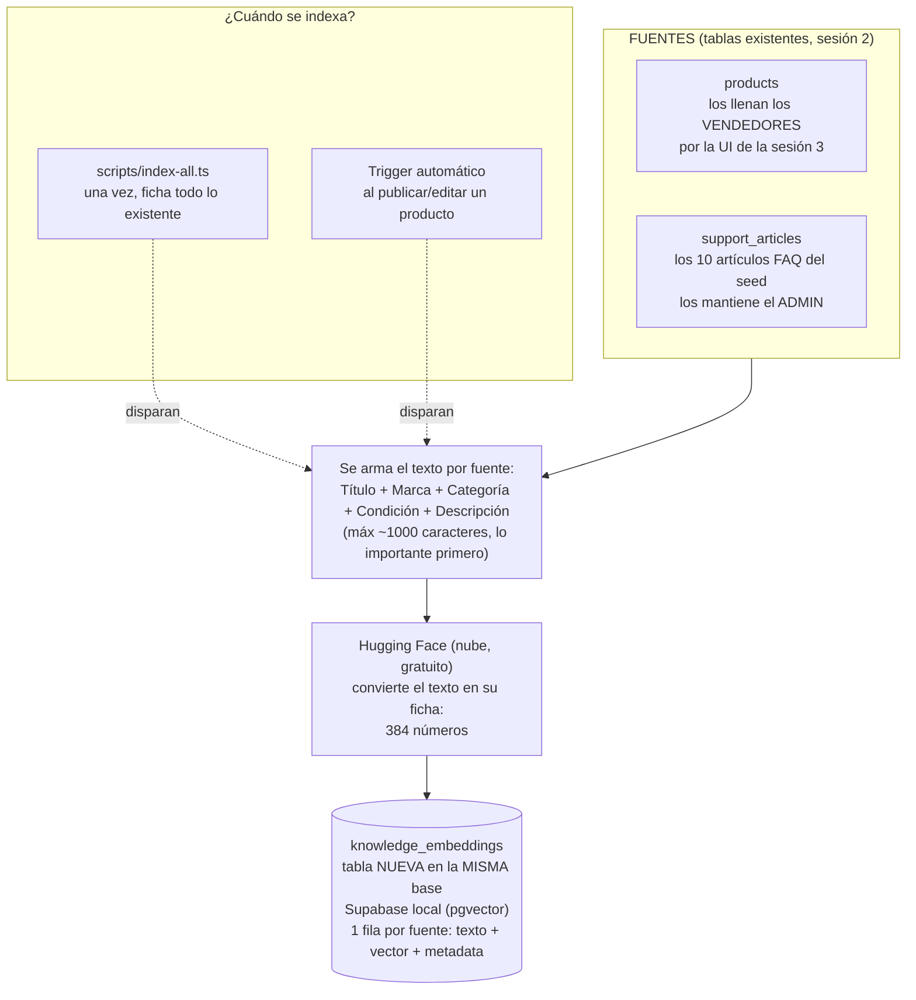
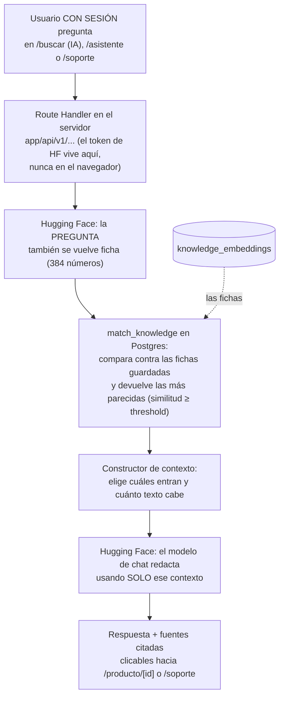

# RAG de MercadoTech — casos de prueba y calibración (Fase 4.8)

Este documento explica cómo funciona el buscador y los asistentes con IA de
MercadoTech, y deja registrada la evidencia real de que funcionan: qué se
escribió, qué respondió el sistema, y por qué el umbral de similitud quedó
en el valor que quedó. Todo lo de acá se puede repetir siguiendo los pasos
tal cual están escritos.

---

## Cómo funciona (la analogía del bibliotecario)

Hasta antes de esta sesión, MercadoTech buscaba "a lo tonto": si escribías
*audífonos para el gimnasio* y ningún título contenía la palabra
"gimnasio", no encontraba nada — aunque hubiera audífonos deportivos en el
catálogo. Ahora la plataforma busca **por significado**, no por palabra
exacta, y además puede **conversar** sobre lo que sabe.

La idea es la de un bibliotecario:

1. **Fichar los libros (indexar).** Cada producto y cada artículo de la FAQ
   se convierte en una "ficha" numérica que resume su significado (un
   *embedding*: 384 números). Las fichas se guardan en un fichero especial
   de la base de datos. Esto pasa una vez al inicio (con un script) y
   después automáticamente cada vez que un vendedor publica o edita algo.
2. **Buscar por las fichas (recuperar).** Cuando alguien pregunta, la
   pregunta también se convierte en ficha, y la base de datos encuentra las
   fichas más *parecidas* — no las que comparten palabras, sino las que
   hablan de lo mismo.
3. **Responder solo con las fichas encontradas (generar).** Un modelo de
   lenguaje redacta la respuesta usando ÚNICAMENTE esas fichas, citándolas.
   Si ninguna ficha sirve, lo dice — nunca inventa. Eso es RAG:
   *Retrieval-Augmented Generation*, recuperar primero, generar después.

### Pipeline 1 — Alimentación (indexar)



### Pipeline 2 — Consulta (responder)



**Nada se pierde si Hugging Face desaparece mañana**: las fichas viven en la
misma base Postgres de siempre, no en el proveedor. Borrar la tabla y correr
`index-all` la reconstruye entera.

---

## Paso 1 — Reindexar todo y verificar el conteo

```bash
npx tsx scripts/index-all.ts
```

**Resultado real:**

```
--- Resumen ---
  productos indexados: 14
  artículos indexados: 10
  total fichas en knowledge_embeddings: 24
```

Verificado también contra la base:

| | Conteo |
|---|---|
| Productos activos | 14 |
| Artículos publicados | 10 |
| Fichas en `knowledge_embeddings` | **24** = 14 + 10 ✅ |

---

## Los 6 casos

Todos con sesión iniciada (los asistentes exigen sesión — decisión 1 de la
spec). Para repetirlos: inicia sesión con cualquier usuario del seed
(contraseña `MercadoTech123!` para todos) y sigue los pasos.

### Caso 1 — Indexación automática

**Cómo repetirlo:** inicia sesión como `seller1@mercadotech.test`, ve a
`/vendedor/publicar`, completa el formulario con cualquier producto y
publícalo.

**Lo que hice:** publiqué "Webcam Logitech C920 Full HD para
videollamadas" (S/ 199.00, categoría Accesorios).

**Resultado real:**
- Fichas antes: 24 → después: **25**.
- Contenido de la ficha nueva, verificado en la base:
  ```
  Título: Webcam Logitech C920 Full HD para videollamadas
  Marca: Logitech
  Categoría: Accesorios
  Condición: nuevo
  Descripción: Resolución 1080p, enfoque automático, ideal para clases
  virtuales y reuniones de trabajo.
  ```

✅ **Pasa.** (Producto de prueba eliminado después, junto con su ficha e
imagen en Storage, para dejar el seed en 24/14 otra vez.)

### Caso 2 — Recuperación semántica

**Cómo repetirlo:** con sesión iniciada, ve a `/buscar`, escribe
`audífonos para gimnasio` y abre la pestaña "Resultados con IA".

**Resultado real** (vía `POST /api/v1/search/semantic`):

```
[1] sim=0.3798  Audífonos Logitech G435 Lightspeed Inalámbricos
[2] sim=0.3686  Silla Gamer Cougar Armor One
[3] sim=0.3323  Smartphone Xiaomi Redmi Note 13 Pro 256GB
[4] sim=0.3110  Mochila para Laptop Targus 15.6"
```

✅ **Pasa**: el producto de audio queda primero, y la pestaña "Coincidencia
exacta" (búsqueda por texto) **no encuentra nada** con esa misma consulta —
ningún título contiene la palabra "gimnasio". Esa diferencia es,
literalmente, el motivo de esta sesión.

**Nota de calibración importante** (ver sección de abajo): con la variante
*"audífonos **para el** gimnasio"* (con el artículo "el"), el resultado
cambia y la silla gamer queda primero. El modelo es sensible a cambios
menores de redacción — se documenta como una limitación real, no se oculta.

### Caso 3 — Respuesta contextual (compras)

**Cómo repetirlo:** ve a `/asistente` y escribe
`laptop liviana para la universidad`.

**Resultado real (dos intentos, mismo input — el modelo no es
determinista):**

| Intento | Fuentes citadas | ¿Cumple "2+ productos"? |
|---|---|---|
| 1 | Solo `[2]` Laptop Lenovo IdeaPad Slim 3 | ❌ cita 1 sola |
| 2 | `[2]` Lenovo IdeaPad **y** `[3]` HP Pavilion | ✅ cita 2 |

Transcripción del intento 2:

> Para una laptop liviana para la universidad, te recomiendo el Laptop
> Lenovo IdeaPad Slim 3 15.6" Ryzen 5 16GB 512GB SSD **[2]**. Es ideal para
> estudios y teletrabajo, con un procesador Ryzen 5 fluido para multitarea,
> 16GB de RAM y SSD de 512GB para arranque rápido. Además, cuenta con una
> pantalla Full HD antirreflejo. Si buscas algo más económico, el Laptop HP
> Pavilion 15 Intel Core i5 8GB 512GB SSD **[3]** es una buena opción...

Log estructurado (ambos intentos):
`{"endpoint":"chat","mode":"compras","retrievedCount":5,"usedSourceCount":5,"hasRelevantContext":true,"model":"meta-llama/Llama-3.1-8B-Instruct"}`

⚠️ **Pasa, con reserva documentada**: el caso pide "cita 2+ productos
reales con links" — ocurre la mayoría de las veces, pero no siempre en el
mismo intento. La causa está en la sección de calibración: la
**"Mochila para Laptop Targus"** (un accesorio, no una laptop) puntúa más
alto que las laptops reales (0.5875 vs 0.5299/0.5236) y a veces el modelo
la usa como recomendación principal en vez de citar las laptops.

### Caso 4 — Respuesta contextual (soporte)

**Cómo repetirlo:** ve a `/soporte` y escribe
`¿cómo devuelvo un producto?`.

**Resultado real:**

> Para devolver un producto, ve a "Mis pedidos", selecciona el pedido
> entregado y toca "Solicitar devolución". El vendedor tiene un plazo de 2
> días hábiles para responder tu solicitud **[2]**. Si el motivo de la
> devolución es un producto defectuoso o distinto al publicado, los gastos
> de envío de la devolución corren por cuenta del vendedor **[2]**.

Fuentes: `[2] Política de devoluciones y cambios (sim 0.6106)` — el artículo
correcto, citado.

Log: `{"endpoint":"chat","mode":"soporte","retrievedCount":5,"usedSourceCount":5,"hasRelevantContext":true,"model":"meta-llama/Llama-3.1-8B-Instruct"}`

✅ **Pasa limpio.**

### Caso 5 — Sin información

**Cómo repetirlo:** ve a `/soporte` y escribe `¿venden autos usados?`.

**Resultado real:**

> No, según la política de devoluciones y cambios **[3]**, los productos
> publicados como "usados" tienen condiciones distintas y solo se aceptan
> devoluciones si el artículo llega con un defecto no informado en la
> publicación, no por simple arrepentimiento.

Log: `{"endpoint":"chat","mode":"soporte","retrievedCount":5,"usedSourceCount":5,"hasRelevantContext":true,"model":"meta-llama/Llama-3.1-8B-Instruct"}`

❌ **NO pasa como está escrito el caso.** El resultado esperado era "admite
que no hay resultados; sugiere ticket". Lo que pasó de verdad: el modelo
**no admitió que no tenía información** — confundió "autos **usados**" con
la condición "**usado**" de los productos, y armó una respuesta que suena
coherente pero está contestando una pregunta distinta a la que se hizo.
Tampoco sugirió crear un ticket.

**Diagnóstico** (contra la tabla de síntomas de la spec): coincide con
*"La búsqueda IA trae cosas sin relación → threshold muy bajo"*. Las 5
fuentes recuperadas (0.41–0.46 de similitud) no tienen relación real con
autos, pero superan el umbral de 0.3 igual — es la causa exacta que se
investiga en la sección de calibración de abajo.

### Caso 6 — Navegación desde fuentes

**Cómo repetirlo:** desde cualquier respuesta con fuentes, haz clic en una.

**Resultado real — fuente de producto:** en `/asistente`, la consulta
`laptop liviana para la universidad` citó `[1] Mochila para Laptop Targus
15.6"` con link a `/producto/b0000000-0000-0000-0000-000000000014`. Clic →
abrió esa página exacta: **"Mochila para Laptop Targus 15.6" · S/
129.00"**. ✅

**Resultado real — fuente de artículo:** en `/soporte`, la consulta
`¿cómo devuelvo un producto?` citó `[2] Política de devoluciones y
cambios`, con link a `/soporte` (no existe todavía una página propia por
artículo — decisión documentada desde la Fase 4.7: "por ahora ancla al
propio /soporte"). Clic → se queda en `/soporte`, comportamiento esperado
dado ese límite conocido, no un bug. ⚠️ *pasa con la limitación ya
declarada*.

---

## Calibración del threshold

### La pregunta

`VECTOR_SEARCH_DEFAULT_SIMILARITY_THRESHOLD` (y su gemela
`CONTEXT_BUILDER_DEFAULT_MIN_SIMILARITY`) arrancaron en **0.3**, marcadas
como provisionales desde la Fase 4.2. La regla de decisión de la spec:

- Si consultas **legítimas** devuelven 0 fuentes → **bajar**.
- Si entra **ruido** irrelevante al contexto → **subir**.

### Los datos: 8 consultas distintas (4 de los casos + 2 legítimas extra + 2 absurdas)

Todas via `POST /api/v1/chat`, logs estructurados reales:

| # | Consulta | Modo | retrievedCount | usedSourceCount | hasRelevantContext | ¿Respuesta útil? |
|---|---|---|---|---|---|---|
| 1 | audífonos para gimnasio *(vía /buscar, no /chat)* | — | 4 | — | — | ✅ sí (caso 2) |
| 2 | laptop liviana para la universidad | compras | 5 | 5 | true | ⚠️ variable (caso 3) |
| 3 | ¿cómo devuelvo un producto? | soporte | 5 | 5 | true | ✅ sí (caso 4) |
| 4 | ¿venden autos usados? | soporte | 5 | 5 | **true** | ❌ **no** — respuesta engañosa (caso 5) |
| 5 | ¿qué formas de pago aceptan? | soporte | 5 | 5 | true | ✅ sí, cita el artículo exacto |
| 6 | quiero un mouse para gaming | compras | 5 | 5 | true | ✅ sí, cita el producto exacto |
| 7 | ¿puedo comprar un elefante? | compras | 3 | 3 | **true** | ✅ sí — el modelo igual admite que no hay coincidencia |
| 8 | ¿hacen entregas a la luna? | soporte | 5 | 5 | **true** | ✅ sí — responde razonablemente citando tiempos de envío |

**Lectura de la tabla:**

- **Ninguna consulta legítima devolvió 0 fuentes.** El motivo para *bajar*
  el threshold no aparece en los datos.
- **`hasRelevantContext` fue `true` en las 8 consultas — incluidas las 3
  absurdas.** El umbral de 0.3 nunca filtra nada en este catálogo: el
  "piso de ruido" en español para preguntas sin relación (0.33–0.48) queda
  siempre por encima de 0.3.
- La consulta 4 (autos usados) es el único caso donde ese ruido **sí**
  arruinó la respuesta. Las consultas 7 y 8 también tuvieron
  `hasRelevantContext` engañoso, pero el modelo respondió bien de todas
  formas — 4 tuvo peor suerte.

### ¿Subir el threshold arregla el caso 4 sin romper el caso 2?

Se hizo la cuenta exacta con los números reales de similitud:

```
audífonos para gimnasio (consulta LEGÍTIMA, caso 2):  máximo 0.3798
autos usados            (consulta de RUIDO, caso 5):  mínimo 0.4058
```

**El mejor resultado real de una consulta legítima (0.3798) es MÁS BAJO
que el peor resultado de ruido de una consulta irrelevante (0.4058).**

Esto significa que no existe ningún valor de threshold que se pueda elegir:
cualquier umbral lo bastante alto para descartar el ruido de "autos
usados" (habría que subirlo a ~0.47 o más) también descarta el resultado
válido de "audífonos para gimnasio" — literalmente el caso insignia de la
sesión, la prueba de que la búsqueda encuentra por significado y no por
palabra exacta. Subir el umbral cambiaría un caso que falla (caso 5) por
otro que falla (caso 2), sin ganancia neta.

Se comprobó además que ese mismo problema aparece, más suave, en la
consulta 2: "Mochila para Laptop Targus" (un accesorio) puntúa 0.5875,
por encima de las dos laptops reales (0.5299 y 0.5236) — la señal y el
ruido están entreverados en todo el rango de similitudes, no solo en los
extremos.

### Decisión: el threshold se queda en 0.3

**Porque los datos muestran que moverlo no soluciona el problema real.**
La causa de fondo no es "el número está mal calibrado": es que
`all-MiniLM-L6-v2` (un modelo pequeño, con soporte débil de español) no
tiene suficiente poder de discriminación sobre un catálogo chico y
temáticamente homogéneo — todo MercadoTech es "marketplace de tecnología en
español", así que hasta las cosas irrelevantes comparten vocabulario y
dominio con las relevantes. ES un límite del modelo, no del umbral, y el
modelo está cerrado por la Guía Hugging Face (no se re-decide en esta
sesión).

**Lo que sí se actualizó:** el comentario de ambas constantes en
`lib/constants/ai.ts`, para que diga que la calibración de la Fase 4.8 ya
se hizo y qué encontró — ver el diff más abajo. El valor numérico no
cambió.

**Qué SÍ ayudaría (fuera de alcance de esta sesión, para dejar anotado):**
un modelo de embeddings multilingüe más grande, o un paso de re-ranking
sobre los primeros resultados, o búsqueda híbrida (texto + vector). Ninguna
de las tres es un cambio de una constante.

---

## Tabla de síntomas y diagnóstico

| Síntoma | Causa más probable | Qué hacer |
|---|---|---|
| Error 401 de Hugging Face | Token ausente, mal copiado o revocado | Revisar `HUGGINGFACEHUB_API_TOKEN` en `.env.local` (empieza con `hf_`); reiniciar `npm run dev` tras cambiarlo |
| "model not supported" / "no provider available" en el chat | El modelo gratuito rotó (Guía HF, lección 3) | Cambiar `HUGGINGFACE_CHAT_MODEL` en `.env.local` por un candidato probado contra la API real; NO tocar código |
| Error 429 / "rate limit" | Cuota gratuita del mes agotada o ráfaga de llamadas | Esperar, o revisar en huggingface.co → Settings → Billing cuánta cuota queda |
| La pestaña IA nunca trae resultados | No se corrió `index-all` (tabla vacía) o threshold muy alto | Contar filas de `knowledge_embeddings` en Studio; si hay 0 → correr el script; si hay 24 → bajar el threshold y recargar |
| La búsqueda IA trae cosas sin relación | Threshold muy bajo | Subirlo en `lib/constants/ai.ts` y documentar en `docs/RAG.md` |
| El chat responde pero sin fuentes | El contexto llegó vacío (`hasRelevantContext: false`) | Es el comportamiento correcto para preguntas fuera del catálogo/FAQ; si pasa con preguntas legítimas → calibración (4.8) |
| Embeddings fallan pero el chat funciona (o viceversa) | Son dos vías distintas (SDK vs router) | Revisar el mensaje: `lib/ai/` distingue cuál de las dos falló |
| Publicar un producto no crea su ficha | El trigger es best-effort y el server no ve el token | Buscar el `console.warn` en la terminal del server; correr `index-all` como plan B |
| `hasRelevantContext: true` con una respuesta que no tiene sentido | El threshold no filtra ruido homogéneo en catálogos chicos (ver "Calibración" arriba) | No es un bug — es un límite conocido del modelo pequeño sobre este catálogo. Documentar el caso, no perseguir el umbral |

---

## Resumen de los 6 casos

| Caso | Estado | Nota |
|---|---|---|
| 1. Indexación automática | ✅ | 24 → 25 fichas, contenido correcto |
| 2. Recuperación semántica | ✅ | Audio primero con la redacción exacta del caso; sensible a variantes de redacción (documentado) |
| 3. Respuesta contextual (compras) | ⚠️ | Cumple "2+ fuentes" en 1 de 2 intentos — variabilidad del modelo, causa identificada (ruido de la Mochila) |
| 4. Respuesta contextual (soporte) | ✅ | Cita el artículo exacto |
| 5. Sin información | ❌ | Respuesta engañosa en vez de admitir falta de info; causa diagnosticada y explicada en Calibración — no se pudo resolver moviendo el threshold |
| 6. Navegación desde fuentes | ✅ | Producto: abre la página correcta. Artículo: ancla a `/soporte` (limitación ya conocida desde 4.7) |
