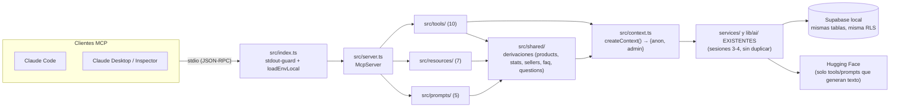

# mercadotech-mcp

Servidor [MCP](https://modelcontextprotocol.io) de **solo lectura** sobre
MercadoTech. Expone el catálogo, las categorías, las reseñas, las preguntas y
la asistencia por IA de la plataforma a cualquier cliente MCP (Claude Code,
Claude Desktop, el Inspector, o el futuro agente de voz de la sesión 8) sin
que ese cliente toque Supabase directamente.

No es una API nueva: es una capa fina sobre los `services/` y `lib/ai/` que
ya usa la web. Ninguna tool, resource ni prompt reimplementa una consulta de
negocio — todas llaman al mismo código que usan `hooks/` en el navegador.

## Qué expone

| Tipo | Cantidad | Qué es |
|---|---|---|
| **Tools** | 10 | Acciones invocables con parámetros ("busca laptops bajo S/ 3,500") |
| **Resources** | 7 | Contenido por URI estable, como leer un archivo (`mercadotech://faq`) |
| **Prompts** | 5 | Plantillas de instrucción con el contenido real ya embebido |

Las tres tablas completas están más abajo. Todo es de solo lectura: ninguna
tool muta datos de la plataforma (`get_order_status` LEE un pedido, no lo
cambia). Ninguna tool/resource expone datos privados de un comprador o
vendedor (email, teléfono, nombre de comprador) — donde hace falta, se dice
explícitamente qué se recorta y por qué.

## Arquitectura



Cada tool/resource/prompt pasa por un wrapper (`safeTool` / `safeResource` /
`safeValue`, en `src/lib/safe.ts`) que atrapa cualquier excepción y la
convierte en un resultado legible en vez de tumbar la sesión. Es lo que hace
que, por ejemplo, `resources/list` siga respondiendo aunque Supabase esté
caído: cada fuente degrada por su cuenta.

## Decisiones y su porqué

**Contexto por llamada, no al arranque** (`src/context.ts`). El proceso puede
vivir horas colgado del stdio de su cliente; un par de clientes de Supabase
construidos una sola vez al iniciar quedarían con credenciales congeladas.
`createContext()` arma `{anon, admin}` nuevos en CADA invocación de
tool/resource/prompt — construir un cliente de `supabase-js` es barato (no
abre conexión, cada consulta es un fetch REST), así que el costo es
despreciable frente al de arrastrar credenciales viejas.

**stdout es sagrado, stderr es el log** (`src/lib/stdout-guard.ts`, importado
como PRIMERA línea de `src/index.ts`). El transporte stdio manda JSON-RPC por
stdout; un solo `console.log` de cualquier módulo (incluidos `services/` o el
propio SDK) lo corrompería. `stdout-guard.ts` redirige `console.log/info/warn`
a `console.error` antes de que se evalúe cualquier otro import — en ESM los
`import` se hoistean, así que el orden de los imports en `index.ts` es lo que
garantiza que la redirección ya esté activa cuando el resto del código carga.
Todo diagnóstico del servidor va por `console.error`.

**Por qué NO importa `lib/supabase/admin.ts`** (`src/context.ts`). Esa capa
está afinada para los entornos de Next (Route Handlers, middleware) y además
importa `"server-only"`, un guard que solo el bundler de Next neutraliza —
bajo `tsx`/Node puro **lanza siempre** (comprobado en este repo:
`scripts/index-all.ts` documenta el mismo problema). El MCP construye sus dos
clientes directamente con `@supabase/supabase-js`, mismo patrón que
`index-all.ts`, incluido el stub de `WebSocket` que Node 20 no trae y que
`supabase-js` exige al construirse aunque no se use realtime.

**anon vs admin, por tool/resource/prompt** — nunca "admin por comodidad". El
cliente por defecto es **anon** (respeta RLS, ve lo mismo que un visitante
anónimo). Se usa **admin** (bypasea RLS) solo donde la tabla lo exige:

- `knowledge_embeddings` solo concede `SELECT` a `authenticated` → toda
  búsqueda/pregunta semántica necesita admin.
- `orders` / `order_items` filtran por `auth.uid()` en sus políticas → sin
  sesión, anon no ve ninguna fila.
- `profiles` no tiene `SELECT` público (`profiles_select_own_or_admin`) →
  el resource de vendedores necesita admin, y por eso mismo recorta la
  salida a `display_name` + productos activos, nunca `phone`.

Cada uso de admin tiene el porqué en un comentario junto al registro de esa
tool/resource — ver la tabla completa más abajo.

**Una sola fuente de credenciales** (`src/env.ts`). Node no carga
`.env.local` solo (eso lo hace Next). El MCP reutiliza el mismo parseo manual
que ya usa `scripts/index-all.ts`, apuntado a la `.env.local` de la RAÍZ del
proyecto — no hay un `.env` propio en `mcp/` que se pueda desincronizar o
duplicar la `service_role` key. `env.ts` busca ese archivo subiendo desde la
ubicación del propio módulo (no desde `process.cwd()`), porque quien lanza el
servidor (Claude Code, el Inspector) puede fijar el cwd a cualquier cosa.

## Variables de entorno

Todas viven en la `.env.local` de la raíz del proyecto Next (`../.env.local`
visto desde `mcp/`), no aquí.

| Variable | Obligatoria | La usa |
|---|---|---|
| `NEXT_PUBLIC_SUPABASE_URL` | Sí | `context.ts` (ambos clientes) |
| `NEXT_PUBLIC_SUPABASE_ANON_KEY` | Sí | `context.ts` (cliente `anon`) |
| `SUPABASE_SERVICE_ROLE_KEY` | Sí | `context.ts` (cliente `admin`) |
| `HUGGINGFACEHUB_API_TOKEN` | No* | `lib/ai/embeddings.ts` y `lib/ai/completion.ts` |

*Sin las tres primeras, el servidor no arranca (falla con un mensaje claro
antes de aceptar conexiones). Sin el token de Hugging Face, arranca igual: las
4 tools/1 prompt que dependen de IA (`semantic_search_products`,
`ask_assistant`, `find_related_products`, `summarize_reviews`) devuelven el
error accionable de `lib/ai/` como resultado de error, y el resto del
servidor sigue funcionando con normalidad.

## Comandos

```bash
# Desde la RAÍZ del proyecto (mercadotech/) — el alias @/* así resuelve:
npx tsx mcp/src/index.ts

# Desde mcp/, en desarrollo (recarga en caliente):
npm run dev

# Type-check de mcp/ (usa el tsconfig que extiende el de la raíz):
npm run type-check

# Build de producción → mcp/dist/index.js (bundle único, ESM, Node 20+):
npm run build
node dist/index.js          # equivalente a `npm run start`

# Inspector oficial contra la versión dev:
npx @modelcontextprotocol/inspector npx tsx mcp/src/index.ts
# ...o contra el build de producción:
npx @modelcontextprotocol/inspector node mcp/dist/index.js

# Inspector en modo CLI (sin navegador), para probar un método puntual:
npx @modelcontextprotocol/inspector --cli npx tsx mcp/src/index.ts \
  --method tools/call --tool-name search_products \
  --tool-args-json '{"search":"laptop"}'
```

`mcp/dist/` es un artefacto de build (gitignored, no se commitea) y está
excluido del `eslint.config.mjs` de la raíz — es el bundle de tsup con el SDK
de MCP incluido, no código propio del proyecto.

## Conectar desde Claude Code

El `.mcp.json` de la raíz ya declara el servidor `mercadotech` (transporte
stdio, comando `npx tsx mcp/src/index.ts`). Claude Code lo detecta al
iniciar una sesión nueva en este proyecto y pide aprobarlo la primera vez —
es el comportamiento esperado.

```json
{
  "mcpServers": {
    "mercadotech": {
      "command": "npx",
      "args": ["tsx", "mcp/src/index.ts"]
    }
  }
}
```

Para producción (tras `npm run build`), la variante equivalente sería:

```json
{
  "mcpServers": {
    "mercadotech": {
      "command": "node",
      "args": ["mcp/dist/index.js"]
    }
  }
}
```

## Tools (10)

| # | Tool | Reutiliza | Cliente |
|---|---|---|---|
| 1 | `search_products` | `product.service.listActiveProducts` | anon |
| 2 | `get_product` | `shared/products.getProductDetail` (→ `product.getProductById` + `getProductImages`, `review.getAverage`, `question.listByProduct`) | anon |
| 3 | `list_categories` | `shared/stats.listCategoriesWithCount` (→ `category.listCategories` + `product.listActiveProducts`) | anon |
| 4 | `semantic_search_products` | `vector-search.service.searchProducts` | **admin** (`knowledge_embeddings`) · requiere token HF |
| 5 | `ask_assistant` | `chat.service.ask` (modos `compras`/`soporte`) | **admin** (`knowledge_embeddings`) · requiere token HF |
| 6 | `compare_products` | `shared/products.compareProducts` (→ `shared/products.getProductsByIds` + `review.getAverage`) | anon |
| 7 | `find_related_products` | `lib/ai/embeddings` + `vector-search.service.searchByEmbedding` (+ `product.getProductById`, `category.listCategories`) | anon (producto de partida) + **admin** (búsqueda) · requiere token HF |
| 8 | `summarize_reviews` | `product.getProductById` + `review.listByProduct`/`getAverage` + `lib/ai/completion.generateCompletion` | anon · requiere token HF |
| 9 | `get_store_stats` | `shared/stats.getStoreStats` (→ `category.listCategories` + `product.listActiveProducts` + `order_items` directo) | anon + **admin** (`order_items`) |
| 10 | `get_order_status` | `order.service.getOrderById` | **admin** (`orders`/`order_items`) — recortado a estado/fecha/total/ítems, nunca datos del comprador |

## Resources (7)

| URI | Reutiliza | Cliente |
|---|---|---|
| `mercadotech://info` | — (estático, no toca Supabase) | — |
| `mercadotech://products` | `shared/products.listAllActiveProductSummaries` (pagina sobre `product.listActiveProducts`) | anon |
| `mercadotech://products/{id}` (template) | `shared/products.getProductDetail` — misma función que la tool `get_product` | anon |
| `mercadotech://categories` | `shared/stats.listCategoriesWithCount` — misma función que la tool `list_categories` | anon |
| `mercadotech://sellers/{sellerId}` (template) | `shared/sellers.ts` (`profiles` directo, solo `display_name`+`role` + `product.PRODUCT_SELECT`/`mapProductRow`) | **admin** (`profiles` sin SELECT público) |
| `mercadotech://faq` | `shared/faq.listPublishedArticles` (`support_articles` directo) | anon |
| `mercadotech://stats` | `shared/stats.getStoreStats` — misma función que la tool `get_store_stats` | anon + **admin** |

Los dos templates implementan el callback `list` (patrón de ReadHub): cada
instancia real aparece en `resources/list` como una entrada navegable, no
solo el patrón `{id}` en abstracto.

## Prompts MCP (5)

Recordatorio de terminología: un **Prompt MCP** vive en el servidor y lo
ofrece el protocolo (`prompts/get`) — no es una Skill de Claude Code
(`.claude/skills/`) ni el prompt que se escribe en el chat.

| Prompt | Argumentos | Reutiliza | Cliente |
|---|---|---|---|
| `describir_producto` | `productId` | `shared/products.getProductDetail` | anon |
| `comparar_productos` | `ids` (string, "id1,id2,id3") | `shared/products.compareProducts` — misma función que la tool `compare_products` | anon |
| `redactar_respuesta_pregunta` | `questionId` | `shared/questions.getQuestionWithProduct` (`questions` directo + `product.getProductById`) | anon |
| `resumen_de_resenas` | `productId` | `product.getProductById` + `review.listByProduct`/`getAverage` (mismos services que la tool `summarize_reviews`, sin `lib/ai/`: el prompt no genera el resumen, lo deja en manos del cliente MCP) | anon |
| `generar_articulo_faq` | `tema` | `shared/faq.listPublishedArticles` — misma función que el resource `mercadotech://faq` | anon |

Cada prompt embebe el contenido real (producto, pregunta, reseñas, artículos)
como un `resource` dentro del mensaje — nunca reimplementa recuperación ni el
pipeline RAG de `ask_assistant`. Cuando el cliente necesita profundizar, el
texto de instrucciones remite a la tool equivalente (`get_product`,
`summarize_reviews`, `compare_products`, `ask_assistant`).

## Si algo falla: síntomas y diagnóstico

| Síntoma | Causa más probable | Qué hacer |
|---|---|---|
| Claude Code no ve el servidor / no aparece en `/mcp` | `.mcp.json` recién creado, sesión vieja, o no se aprobó el servidor | Reiniciar la sesión de Claude Code; aprobar el servidor cuando lo pregunte |
| El Inspector conecta pero "se cae" al primer uso | Algo escribió en stdout | Buscar `console.log` sin redirigir; los logs van a stderr (ver `stdout-guard.ts`) |
| Error de tipos/validación al registrar tools | zod 4 instalado | Pinnear `zod@^3.25.76` en `mcp/package.json` y reinstalar |
| "This module cannot be imported…" al arrancar | Algo importó `lib/supabase/admin.ts` (`server-only`) | El MCP construye sus clientes en `src/context.ts`; revisar imports nuevos |
| "Faltan NEXT_PUBLIC_SUPABASE_URL…" | Node no carga `.env.local` solo | Verificar que `env.ts` corre ANTES de crear contexto y que se lanza desde la raíz del repo |
| Tools semánticas devuelven vacío siempre | Se usó cliente anon contra `knowledge_embeddings` | Esas tools usan el cliente admin del contexto |
| Tools semánticas fallan con 401/modelo | Token HF ausente o modelo rotado | Ver `docs/RAG.md` (misma tabla de síntomas de la sesión 4) |
| `Cannot find module '@/services/…'` | Se lanzó desde otra carpeta o el alias no resuelve | Lanzar `npx tsx mcp/src/index.ts` desde la raíz; en build, revisar la resolución del alias en `tsup.config.ts` |

## Restricciones vigentes

- Solo lectura: ninguna tool/resource/prompt muta datos de la plataforma.
- Nada de carritos, favoritos, tickets de soporte ni pedidos ajenos.
- `get_order_status` es la única tool que toca un pedido, y solo LEE estado
  y snapshots — en producción exigiría autenticación del comprador (el MCP no
  la tiene; ver el comentario en `src/tools/get-order-status.ts`).
- No se agregaron services nuevos al proyecto web "para el MCP": donde faltó
  uno, la composición vive en `src/shared/` y está documentada como
  derivación.
